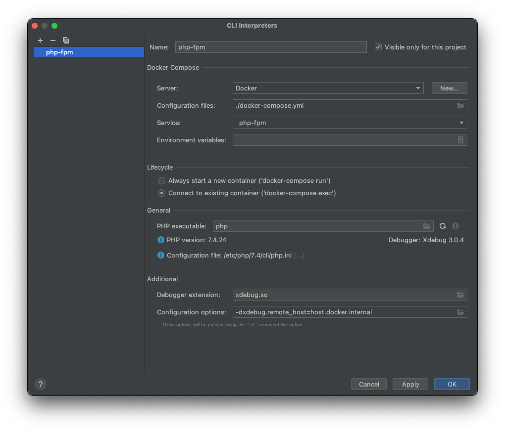
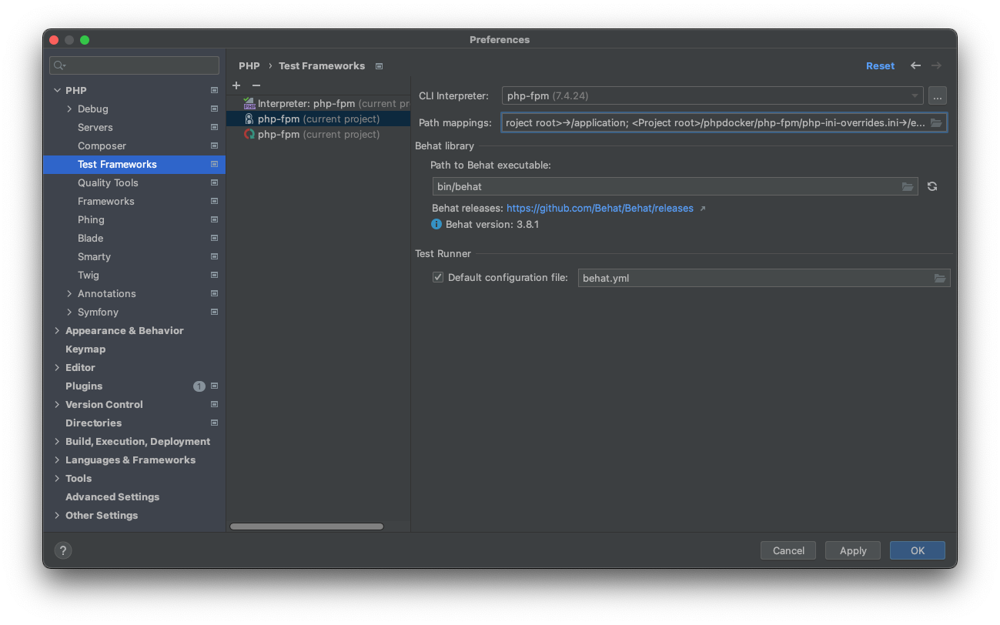
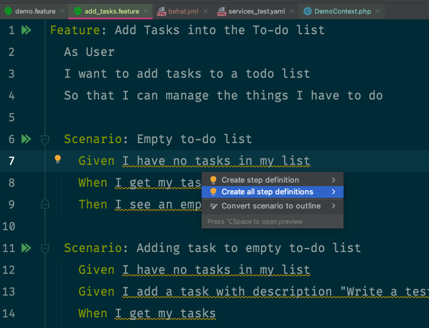
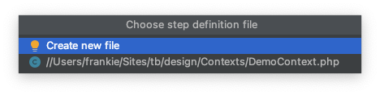
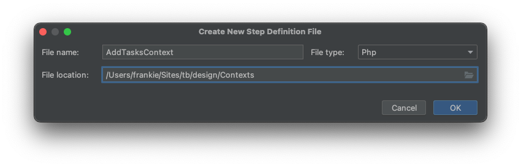
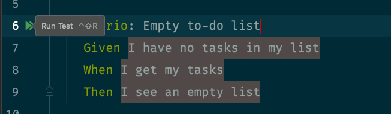
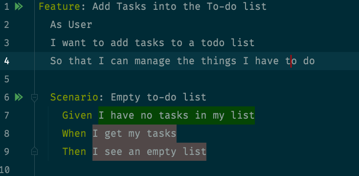

_Outside-in TDD_ se ha convertido en mi primera opción para desarrollar nuevas features en los proyectos en los que trabajo. Hasta ahora he estado trabajando únicamente con **phpunit**, pero estoy preparando una especie de _side-project_ para cambiar el modo en que hago los tests de aceptación.

1. [Introducción, herramientas y ejemplo](/outside-in-with-behat-phpspec/)
2. [Desarrollo del segundo escenario](/outside-in-with-behat-phpspec-2/)
3. [Desarrollo del tercer escenario](/outside-in-with-behat-phpspec-3/)
4. [Manejando bugs con BDD](/outside-in-with-behat-phpspec-4/)
5. [Añadiendo nuevas features](/outside-in-with-behat-phpspec-5/)


A medida que he ido profundizando en _outside-in TDD_, me he dado cuenta de que está muy cerca de Behavior Driven Development. De hecho, normalmente acabo refactorizando esos tests, que escribo en **phpunit**, hasta que se parecen a escenarios de BDD.

Sin embargo, estos tests siguen siendo demasiado técnicos como para que resulten útiles a negocio. Es por eso, que he pensado dar el último paso y empezar a escribirlos usando el lenguaje Gherkin, con la ayuda de **behat** (el port de **Cucumber** para PHP) y, ya de paso, probar a introducir **phpspec**, como forma de acentuar las diferencias entre los tests-ejemplos que guían el desarrollo y los tests de control de calidad.

En este primer artículo, me voy a centrar en la elección y configuración de las herramientas.

## Las herramientas

Para este proyecto vamos a utilizar **behat** y **phpspec** como herramientas de desarrollo. Comparando con el proceso de outside-in que podéis ver en el libro [Aprende Test Driven Development](https://leanpub.com/tddcourse) o en [este vídeo](https://www.youtube.com/playlist?list=PLYT8quZ2BEnb8qo8y9gUXjowYeMbIIVRe), el test de **behat** ocuparía el lugar del test de aceptación, mientras que **phpspec** lo usaríamos para los ciclos de test unitario con los que diseñamos e implementamos cada componente.

De hecho nos ofrecen varias ventajas interesantes:

**behat** nos permite describir las features de la aplicación con un lenguaje de negocio. Como ya sabrás, [Gherkin es un lenguaje cuasi-natural](https://cucumber.io/docs/gherkin/) con unos pocos elementos de sintaxis y estructura. Los documentos Gherkin son convertidos por **behat** en tests ejecutables vinculados de tal manera que podemos ver el resultado en el mismo documento.

**phpspec**, está preparada para funcionar mejor si seguimos ciertas prácticas de diseño que coinciden mucho con las prácticas de _outside-in_. Esto nos ayuda a focalizarnos en cómo nuestra clase interactúa con sus colaboradores, muchas veces mediante dobles. La herramienta no es buena para los test de QA, aunque esto no es necesariamente una desventaja.

No hay ningún problema en utilizar **phpunit** en lugar de **phpspec**, pero el diseño de esta última favorece el tipo de prácticas en las que se basa _outside-in TDD_. Por esa razón es la que hemos elegido para este proyecto. Sin embargo, en los proyectos de trabajo seguiré con **phpunit**, seguramente.

Otra opción sería utilizar [Codeception](https://codeception.com), que nos permite realizar todo tipo de tests. No descarto una versión de este mismo proyecto basada en este paquete.

### Preparando el entorno

El entorno de trabajo será symfony 5.3 con PHP 7.4. En realidad da un poco igual el entorno que uses, pero de este modo puedo darte una referencia. Podrías hacerlo en Laravel, por ejemplo.

_De hecho, salvando las distancias, podrías usar cualquier lenguaje de programación que tenga un entorno de test que sea port de Cucumber._

Si usas [nuestro repo](https://github.com/franiglesias/tb), deberías poder ver la pantalla de bienvenida de symfony en `localhost:8088`. Para entrar en el contenedor usa:

```
docker exec -it tb-php-fpm bash
```

En el resto del artículo asumiré que estamos trabajando dentro del contenedor.

### Instalación de behat

Nosotras vamos a desarrollar una API por lo que nos interesa decidir cómo vamos a hacer los tests que la utilicen. Tenemos dos opciones:

* La más sencilla es usar las extensiones de **behat** + **symfony** que nos permiten utilizar un `Kernel` de **symfony** para simular las peticiones a la API. Esto nos permite tests más rápidos, pero que están acoplados a **symfony**. Puede que esto no sea un problema, por lo que es una opción a considerar.
* La otra posibilidad es usar un cliente HTTP con el que hacer peticiones "reales" contra la API. La principal ventaja es que no te acoplas a un framework concreto. Los tests serían un poco más lentos.

En cualquier caso, es relativamente fácil cambiar entre ambas opciones. [Este artículo en Symfony Casts](https://symfonycasts.com/blog/behat-symfony), explica cómo hacer ambos tipos de instalación.

Así que vamos a empezar por la primera opción y luego veremos cómo traducir un tipo de test en otro.

Usamos `composer` para instalar las dependencias que necesitamos, incluyendo **behat**:

```bash
composer require friends-of-behat/mink-extension friends-of-behat/mink-browserkit-driver friends-of-behat/symfony-extension --dev
```

Esta instalación añade varias cosas a nuestro proyecto, entre ellas la configuración básica de behat y un escenario de demostración.

Para probarlo puedes ejecutar:

```
bin/behat
```

Esto te dirá si todo está bien instalado.

Es bastante fácil integrar **behat** con **phpstorm** y, de hecho, me parece una integración buenísima. Las últimas versiones de **phpstorm** incorporan soporte para **behat** y **Gherkin** de serie. El plugin **Cucumber+** puede ser una buena idea, aunque no creo que sea especialmente necesario.

Básicamente necesitas configurar un nuevo _Test framework_ en las preferencias de PHPStorm > PHP > Test frameworks.

Lo primero es elegir el PHP CLI, que en nuestro caso estaba configurado como intérprete remoto en docker. 



El ejecutable de behat será habitualmente `bin/behat` o `vendor/bin/behat` y el archivo de configuración `behat.yml`.



Lo cierto es que con esto debería ser suficiente para empezar a trabajar.

Por defecto, behat espera encontrar las definiciones de las features en la carpeta `features` en la raíz del proyecto. Esto se puede personalizar. Por ejemplo, imagina que quieres tenerla dentro de la carpeta `tests`. Así es como cambiaríamos nuestro `behat.yml`:

```yaml
default:
  suites:
    default:
      paths:
        - "%paths.base%/tests/features"
      contexts:
        - App\Tests\behat\DemoContext
  extensions:
    FriendsOfbehat\SymfonyExtension: null
```

### Instalación de phpspec

Para instalarlo:

```bash
composer require --dev phpspec/phpspec
```

Por lo general necesitaremos algo de configuración. Este es nuestro archivo de configuración:

```yaml
suites:
  example_suite:
    namespace: App
    psr4_prefix: App
    src_path: '%paths.config%/src'
    spec_path: '%paths.config%/tests'
    spec_prefix: Spec
```

En este ejemplo tenemos un par de detalles en los que fijarnos:

El parámetro `namespace` sirve para definir el namespace y ubicación correcta de nuestro código. En principio debe coincidir con la raíz del namespace que tengamos definido en composer:

```json
"autoload": {
    "psr-4": {
        "App\\": "src/"
    }
},
```

`scr_path` es la carpeta src de nuestro proyecto. `%paths.config%`, de hecho, apunta a la raíz del mismo. PHPSpec usa esto para sus generadores de código, que veremos más adelante.

`spec_prefix` es el nombre de la carpeta en la que van a ir nuestras especificaciones, mientras que `spec_path` es la ruta en la que reside. 

`psr4_prefix` permite a **phpspec** colocar la especificación generada en la carpeta correcta, teniendo en cuenta dónde está la raíz del espacio de nombres en el sistema de ficheros.

Es importante tener en cuenta que las especificaciones se ubicarán en un namespace compuesto por la fórmula `spec_prefix\namespace`. En el ejemplo que hemos puesto, sería: `Spec\App`.

### Nuestra configuración del proyecto

Una cuestión en la que estoy pensando últimamente es si nuestras _features_, _contexts_ y _specs_ (y test de TDD en general) deberían ir o no en la misma carpeta que los tests. Por una parte, tenerlo todo en `tests` parece cómodo y conveniente, pero como hemos comentado en otras ocasiones y señalan varios autores, los tests de TDD, incluyendo los de estilo BDD, son ejemplos que guían el diseño y el desarrollo de la aplicación, pero no son exactamente tests de QA, a pesar de que se puedan reutilizar en gran parte con esa función.

Para este ejemplo, he pensado en aplicar esta idea de modo que exista una carpeta `design` en la raíz del proyecto que contenga todos estos tests o ejemplos que guíen el desarrollo.

De este modo, la configuración queda como sigue:

Necesitaremos definir los namespaces en `composer.json`. El namespace base será `App\`, mientras que para tests y especificaciones será `Tests\App\` y 'Spec\App', respectivamente.

```json
    "autoload": {
        "psr-0": {
            "": "src"
        },
        "psr-4": {
            "App\\": "src/"
            }
        },
        "autoload-dev": {
            "psr-4": {
                "Tests\\App\\": "tests/",
                "Design\\App\\": "design/",
                "Spec\\App\\": "design/Spec/"
            }
    },
```

Para que `phpspec.yml` encuentre todo en el lugar adecuado usamos el siguiente archivo de configuración. La documentación de esta herramienta no es muy explícita en esta parte y me ha costado un poco encontrar la adecuada.

**phpspec.yml**

```yaml
suites:
  example_suite:
    namespace: App
    psr4_prefix: App
    spec_prefix: Spec
    src_path: '%paths.config%/src'
    spec_path: '%paths.config%/design'
```

**behat** requiere algunos ajustes también, y nuestro `behat.yml` queda así:

**behat.yml**

```yaml
default:
  autoload:
    '': '%paths.base%/design'
  suites:
    default:
      paths: [ 'design/Features' ]
      contexts:
        - App\Design\Contexts\DemoContext

  extensions:
    FriendsOfbehat\SymfonyExtension: { }
```

Aparte, gracias al uso de la extensión de Symfony para behat, tenemos que tocar un poco `config/services_test.yaml` de symfony, para que el contenedor sepa encontrar los contextos, ya que por defecto se configura en otra ubicación.

```yaml
services:
  _defaults:
    autowire: true
    autoconfigure: true

  App\Design\Contexts\:
    resource: '../design/Contexts/*'
```

La carpeta `design` quedaría finalmente así:

```
design
├── Contexts
│   └── DemoContext.php
├── Features
│   └── demo.feature
└── Spec
```

### Configuración avanzada

Aparte de lo anterior, vamos a intentar añadir algunas utilidades que nos facilitarán la vida.

`phpspec` es conocido por su capacidad para generar código. Sin embargo, sus plantillas por defecto necesitan un poco de cariño. Añade los siguientes archivos a una carpeta `.phpspec` (con el punto delante):

**class.tpl**: Es una plantilla para las clases.

```php
<?php
declare (strict_types = 1);%namespace_block%

final class %name%
{
}
```

**specification.tpl**: es una plantilla para las especificaciones. La anotación `@mixin` debería ayudarnos a obtener el autocompletado correcto en el IDE.

```php
<?php

namespace %namespace%;

use %subject%;
use PhpSpec\ObjectBehavior;
use Prophecy\Argument;

/**
 * @mixin %subject_class%
 */
class %name% extends ObjectBehavior
{
    public function it_is_initializable(): void
    {
        $this->shouldHaveType(%subject_class%::class);
    }
}
```

Con esto deberíamos tener suficiente para empezar, aunque es posible que más adelante tengamos que tocar algunas cosas.

En cualquier caso, [si usas el repositorio](https://github.com/franiglesias/tb) todo esto viene ya configurado. Solo tienes que levantar el contenedor, entrar en él y ejecutar `composer install`.

```
docker-compose up -d
docker exec -it tb-php-fpm bash
composer install
```

## Diseñando features con Gherkin

Nuestra aplicación es un gestor de tareas muy simple en el que podemos añadir tareas, ver la lista de las que tenemos y marcar las que hemos hecho. Es el ejemplo que hemos usado en libros y vídeos porque el dominio es muy fácil de entender, a la vez que la aplicación nos permite desarrollar una arquitectura razonablemente sofisticada.

### ¿Qué va primero: el huevo o la gallina?

¿Por dónde empezar? Si usamos por primera vez esta aplicación no tendremos ninguna tarea, por lo que nuestro primer deseo sería poder añadir tareas. Sin embargo, para que la aplicación sea útil es necesario poder ver las tareas, de forma que pueda saber que las he añadido correctamente.

Otra forma de enfocarlo es la siguiente: para poder saber que la lista de tareas está vacía, debería poder comprobar que no hay tareas en ella, así que el sistema me estaría indicando de alguna forma que tengo que añadirlas.

Así pues, puedo plantear la feature de añadir tareas a la lista, pero diseñando diversos escenarios, como que no tengo ninguna tarea incorporada al sistema, qué ocurre cuando añado una o qué ocurre cuando añado una más. Este es la definición que pondremos en **design/Features/add_tasks.feature**.

```gherkin
Feature: Add Tasks into the To-do list
  As User
  I want to add tasks to a todo list
  So that I can manage the things I have to do

  Scenario: Empty to-do list
    Given I have no tasks in my list
    When I get my tasks
    Then I see an empty list

  Scenario: Adding task to empty to-do list
    Given I have no tasks in my list
    Given I add a task with description 'Write a test that fails'
    When I get my tasks
    Then I see a list containing:
      | id | Description | Done |
      |  1 | Write a test that fails | no |

  Scenario: Adding task to non empty to-do list
    Given I have tasks in my list
    Given I add a task with description 'Write code to make test pass'
    When I get my tasks
    Then I see a list containing:
      | id | Description | Done |
      |  1 | Write a test that fails | no |
      |  2 | Write code to make test pass | no |
```

Si usamos la integración con **PHStorm**, veremos como nos muestra botones para ejecutar el test y también que nos indica que los pasos no están definidos todavía. Pulsando `alt-enter`, el menú contextual de intenciones nos proporcionará la opción de generar todas las definiciones, creando el archivo Context si así lo deseamos:.



Aquí solicitamos la creación de un nuevo archivo:



Y aquí le damos nombre y escogemos su ubicación:



Es importante añadir el contexto recién creado al archivo de configuración **behat.yml** y asegurarse de que la clase `AddTasksController` tiene el namespace correcto, el cual debería ser `Design\App\Contexts`.

```yaml
default:
    autoload:
        '': '%paths.base%/design'
    suites:
        default:
            paths: [ 'design/Features' ]
            contexts:
                - Design\App\Contexts\DemoContext
                - Design\App\Contexts\AddTasksContext
    extensions:
        FriendsOfBehat\SymfonyExtension: { }
```

También podemos hacerlo a mano para entender cómo funciona. En ese caso, debemos realizar algunos preparativos.

Crea una clase `AddTaskContext` que implemente la interfaz `Context` en `desing/Contexts` (fíjate en el namespace):

```php
<?php
declare (strict_types=1);

namespace Design\App\Contexts;

use behat\behat\Context\Context;

class AddTasksContext implements Context
{
}
```

Añade el FQCN de la nueva clase en la definición de la suite correspondiente en el archivo **behat.yml**. En nuestro caso la suite es default.

```yaml
default:
    autoload:
        '': '%paths.base%/design'
    suites:
        default:
            paths: [ 'design/Features' ]
            contexts:
                - Design\App\Contexts\DemoContext
                - Design\App\Contexts\AddTasksContext
    extensions:
        FriendsOfbehat\SymfonyExtension: { }
```

Esto permitirá a **behat** saber con qué contextos puede relacionar los pasos de los escenarios.

Lo siguiente es generar las definiciones en el archivo `AddTasksContext`. Podemos hacerlo a mano, pero la automatización se agradece. En la terminal:

```bash
bin/behat --snippets-for --append-snippets
```

Al ejecutar nos dará como resultado un menú de opciones sobre dónde generar las definiciones:

```
  [0] None
  [1] Design\App\Contexts\DemoContext
  [2] Design\App\Contexts\AddTasksContext
```

Si pulsamos `2` (o incluso recorriendo el menú con las teclas del cursor arriba y abajo) se seleccionará `AddTasksContext` y se añadirán las definiciones.

### Pero, ¿qué son las definiciones?

Las definiciones de los pasos son métodos en la correspondiente clase `*Context` que están asociados a un paso de cada escenario del archivo Gherkin. Constan del método y de una expresión que encaja (_match_) con el texto del paso del escenario. De este modo, el sistema puede identificar qué paso del escenario en una _feature_ corresponde con qué método en un contexto.

Veamos un ejemplo:

```php
    /**
     * @Given I have no tasks in my list
     */
    public function iHaveNoTasksInMyList()
    {
        throw new PendingException();
    }
```

La anotación `@Given` define el tipo de paso, que es una precondición para el test. El texto a continuación coincide exactamente con el del paso. De este modo, cuando ejecutamos el contexto, **behat** sabe que el paso 'Given I have no tasks in my list' está relacionado con el método `iHaveNoTasksInMyList` y usa su resultado para mostrarlo.

Por defecto, se lanza la excepción `PendingException`, lo que hace que **behat** muestre que es necesario implementar un test primero. Si ejecutamos:

```
bin/behat
```

El resultado será algo parecido a esto:

```
Feature: Add Tasks into the To-do list
  As User
  I want to add tasks to a todo list
  So that I can manage the things I have to do

  Scenario: Empty to-do list         # design/Features/add_tasks.feature:6
    Given I have no tasks in my list # Design\App\Contexts\AddTasksContext::iHaveNoTasksInMyList()
      TODO: write pending definition
    When I get my tasks              # Design\App\Contexts\AddTasksContext::iGetMyTasks()
    Then I see an empty list         # Design\App\Contexts\AddTasksContext::iSeeAnEmptyList()
    
    [...]
```

Aquí se nos muestra la asociación entre pasos y el método del contexto que se ejecutará. También podemos ver que aparece el mensaje 'TODO: write pending definition', que es el resultado de la excepción `PendingException`.

Arriba he mostrado la parte del primer escenario. Pero la salida completa de behat nos muestra el resultado de todos los escenarios. Como se puede ver, en el segundo y tercer escenario se repite el paso 'Given I have no tasks in my list' y también nos muestra que es necesario definirlo:

```
  Scenario: Adding task to empty to-do list                       # design/Features/add_tasks.feature:11
    Given I have no tasks in my list                              # Design\App\Contexts\AddTasksContext::iHaveNoTasksInMyList()
      TODO: write pending definition
    Given I add a task with description 'Write a test that fails' # Design\App\Contexts\AddTasksContext::iAddATaskWithDescription()
    When I get my tasks                                           # Design\App\Contexts\AddTasksContext::iGetMyTasks()
    Then I see a list containing:                                 # Design\App\Contexts\AddTasksContext::iSeeAListContaining()
      | id | Description             | Done |
      | 1  | Write a test that fails | no   |
```

Esto es muy interesante. Nos está diciendo que si escribimos los pasos de los escenarios exactamente iguales, podemos reutilizarlos y podemos reutilizar sus definiciones. Esto nos permitirá que el test sea más fácil de mantener.

#### Definiciones parametrizadas

Veamos ahora una definición un poco distinta:

```php
    /**
     * @Given I add a task with description :arg1
     */
    public function iAddATaskWithDescription($arg1)
    {
        throw new PendingException();
    }
```

El punto más interesante de la misma es que parte de la misma ha sufrido una transformación. El paso definido originalmente era:

```
Given I add a task with description 'Write a test that fails' 
```

Y se ha convertido en:

```
@Given I add a task with description :arg1
```

behat ha sabido interpretar que cuando una parte del paso va entre comillas lo que queremos es un argumento que deseamos pasar al test y, de hecho, la signatura del método contiene un parámetro.

```php
public function iAddATaskWithDescription($arg1)
```

Así, en el tercer escenario, el paso:

```
Given I add a task with description 'Write code to make test pass'
```

Remite al mismo método. Cuando se ejecuta el contexto, se pasa el valor del parámetro que está definido en el paso.

#### Definiciones con tablas de datos

El último tipo de definición que veremos ahora es este:

```php
    /**
     * @Then I see a list containing:
     */
    public function iSeeAListContaining(TableNode $table)
    {
        throw new PendingException();
    }
```

En el archivo Gherkin, podemos ver que hemos representado los resultados esperados en forma de tabla. behat es capaz de identificar esto y la pasa como parámetro en forma de objeto `TableNode`, que nos proporciona métodos para acceder a los datos organizados en filas y columnas.

```gherkin
    Then I see a list containing:
      | id | Description | Done |
      |  1 | Write a test that fails | no |
      |  2 | Write code to make test pass | no |
```

#### Regexp y Turnip

Hay una diferencia en el modo en que `phpstorm` genera las definiciones y lo que ocurre cuando lo hacemos en la terminal. Si no se especifica de otro modo, `phpstorm` usará _regexp_ para generar las anotaciones, mientras que en la terminal el formato es _turnip_, que es más fácil de entender.

Esto se controla añadiendo la opción `--snippets-type`, que puede tener los valores `regexp` o `turnip`.

Como su nombre indica, el formato `regexp` hace que la definición tenga con coincidir con una expresión regular. Esto nos puede dar mucha flexibilidad a la hora de que distintas expresiones equivalentes sean traducidas a la misma definición.

`Turnip`, por otro lado, es un formato un poco más ligero y fácil de interpretar, especialmente si te sientes incómoda con las expresiones regulares.

## Implementemos el escenario más sencillo

De momento, en el artículo nos hemos detenido en mucho detalle con la configuración y preparación de **behat**. Es algo necesario porque la documentación disponible no es demasiado buena en algunos aspectos de configuración, aunque sí lo es para la parte de escritura de ejemplos y la creación de contextos.

Para terminar esta entrega, entonces vamos a intentar implementar el escenario más sencillo:

```gherkin
Feature: Add Tasks into the To-do list
  As User
  I want to add tasks to a todo list
  So that I can manage the things I have to do

  Scenario: Empty to-do list
    Given I have no tasks in my list
    When I get my tasks
    Then I see an empty list
```

Una vez generado el archivo de AddTasksContext, que de momento queda así:

```php
<?php
declare (strict_types=1);

namespace Design\App\Contexts;

use Behat\Gherkin\Node\TableNode;
use Behat\Behat\Tester\Exception\PendingException;
use Behat\Behat\Context\Context;

class AddTasksContext implements Context
{

    /**
     * @Given I have no tasks in my list
     */
    public function iHaveNoTasksInMyList()
    {
        throw new PendingException();
    }

    /**
     * @When I get my tasks
     */
    public function iGetMyTasks()
    {
        throw new PendingException();
    }

    /**
     * @Then I see an empty list
     */
    public function iSeeAnEmptyList()
    {
        throw new PendingException();
    }

    /**
     * @Given I add a task with description :arg1
     */
    public function iAddATaskWithDescription($arg1)
    {
        throw new PendingException();
    }

    /**
     * @Then I see a list containing:
     */
    public function iSeeAListContaining(TableNode $table)
    {
        throw new PendingException();
    }

    /**
     * @Given I have tasks in my list
     */
    public function iHaveTasksInMyList()
    {
        throw new PendingException();
    }
}
```

Ejecuto el escenario usando la interfaz de **phpstorm**.



El resultado se muestra tanto en la pestaña `Run` como en el propio archivo add-tasks.feature: las definiciones que no están implementados se muestran con un color marrón.

Por terminal podría usar lo siguiente, indicando que quiero ejecutar el escenario que se encuentra en la línea 6 del archivo.

```bash
bin/behat design/Features/add_tasks.feature:6
```

El resultado sería:

```
Feature: Add Tasks into the To-do list
  As User
  I want to add tasks to a todo list
  So that I can manage the things I have to do

  Scenario: Empty to-do list         # design/Features/add_tasks.feature:6
    Given I have no tasks in my list # Design\App\Contexts\AddTasksContext::iHaveNoTasksInMyList()
      TODO: write pending definition
    When I get my tasks              # Design\App\Contexts\AddTasksContext::iGetMyTasks()
    Then I see an empty list         # Design\App\Contexts\AddTasksContext::iSeeAnEmptyList()

1 scenario (1 pending)
3 steps (1 pending, 2 skipped)
0m0.19s (12.18Mb)
```

En ambos casos, **behat** nos está diciendo que hay definiciones sin implementar. Así que vamos a ello.

## Primer paso del escenario

El primer paso es `I have no tasks in my list` y lo cierto es que para no tener tareas en la lista realmente no necesito hacer nada. Al menos, no de momento.

Por tanto, cambiamos AddTasksContext de esta manera:

```php
<?php
declare (strict_types=1);

namespace Design\App\Contexts;

use Behat\Gherkin\Node\TableNode;
use Behat\Behat\Tester\Exception\PendingException;
use Behat\Behat\Context\Context;

class AddTasksContext implements Context
{

    /**
     * @Given I have no tasks in my list
     */
    public function iHaveNoTasksInMyList()
    {
    }

    //...
}
```

Simplemente, quitamos la línea que lanza la excepción. Si ejecutamos de nuevo el escenario, vemos el cambio. Este es el resultado en la terminal:

```
Feature: Add Tasks into the To-do list
  As User
  I want to add tasks to a todo list
  So that I can manage the things I have to do

  Scenario: Empty to-do list         # design/Features/add_tasks.feature:6
    Given I have no tasks in my list # Design\App\Contexts\AddTasksContext::iHaveNoTasksInMyList()
    When I get my tasks              # Design\App\Contexts\AddTasksContext::iGetMyTasks()
      TODO: write pending definition
    Then I see an empty list         # Design\App\Contexts\AddTasksContext::iSeeAnEmptyList()

1 scenario (1 pending)
3 steps (1 passed, 1 pending, 1 skipped)
0m0.20s (12.18Mb)
```

Y esto lo que ocurre en phpstorm:



En resumen: nuestro primer paso ha pasado con éxito y está en verde. Pero es un poco raro porque no estamos haciendo nada y eso es un arma de doble filo.

Los tests de behat solo necesitan poder ejecutarse sin errores para darlos por buenos. Para verlos fallar necesitamos que se lance una excepción o que falle algo en el código de producción.

Si tenemos un método vacío, como es el caso, el paso se dará como realizado. O simplemente, si ponemos código que no falle.

Normalmente tendremos que añadir alguna forma de verificar que el paso se ha ejecutado correctamente. Básicamente de dos maneras:

* El código de producción falla por alguna razón.
* En el test verificamos que se haya producido un cierto resultado y lanzamos una excepción si no es así. Para ello, lo más sencillo sería usar una biblioteca de aserciones, como la de **phpunit** o cualquier otra.

Para nuestro ejemplo, y solo temporalmente, vamos a dejarlo así.

## Segundo paso del escenario: obtener la lista de tareas vacía

El segundo paso del escenario tiene esta definición, que espera ser implementada:

```php
    /**
     * @When I get my tasks
     */
    public function iGetMyTasks()
    {
        throw new PendingException();
    }
```

Para obtener la lista de tareas tendríamos que llamar al endpoint correspondiente de la API:

```
GET /api/todo
```

Que esperamos nos devuelva un array de datos con la lista de tarea. En este ejemplo, queremos que la lista esté vacía, pero eso es algo que verificaremos en el último paso. Aquí solo queremos obtener la respuesta de la API y guardarla hasta que la necesitemos.

Ahora bien, una buena manera de saber si la API no está respondiendo en este punto es verificar si el código de respuesta es `200 OK`.

Hemos dicho al principio que íbamos a usar la integración de Behat con Symfony para simular las peticiones a la API mediante el uso del Kernel. Esta será entonces nuestra primera implementación. Como nota curiosa señalar que para hacer las aserciones estoy usando las de la librería **Webmozart** en lugar de las de **phpunit**. La razón es que son un poco más compactas, pero no hay ningún motivo para no usar las de **phpunit**.

```php
<?php
declare (strict_types=1);

namespace Design\App\Contexts;

use Behat\Gherkin\Node\TableNode;
use Behat\Behat\Tester\Exception\PendingException;
use Behat\Behat\Context\Context;
use Webmozart\Assert\Assert;
use Symfony\Component\HttpFoundation\Request;
use Symfony\Component\HttpFoundation\Response;
use Symfony\Component\HttpKernel\KernelInterface;

class AddTasksContext implements Context
{
    private KernelInterface $kernel;
    private Response $response;

    public function __construct(KernelInterface $kernel)
    {
        $this->kernel = $kernel;
    }

    /**
     * @Given I have no tasks in my list
     */
    public function iHaveNoTasksInMyList(): void
    {
        /** Empty for the moment */
    }

    /**
     * @When I get my tasks
     */
    public function iGetMyTasks(): void
    {
        $request = Request::create(
            '/api/todo',
            'GET'
        );

        $this->response = $this->kernel->handle($request);

        Assert::eq(Response::HTTP_OK, $this->response->getStatusCode());
    }

    //...
}
```

Vayamos por partes. Al usar la extensión de Symfony, los Contexts se definen en services_test.yaml y gracias al _autowiring_ y al _autoconfigure_, podemos hacer cosas como inyectarles servicios. 

```yaml
services:
    _defaults:
        autowire: true
        autoconfigure: true

    Design\App\Contexts\:
        resource: '../design/Contexts/*'
```
En este caso, el **Kernel** de **symfony**.

```php
class AddTasksContext implements Context
{
    private KernelInterface $kernel;
    private Response $response;

    public function __construct(KernelInterface $kernel)
    {
        $this->kernel = $kernel;
    }
```

Gracias a eso, podemos simular que enviamos una petición a la API.

```php
$request = Request::create(
    '/api/todo',
    'GET'
);

$this->response = $this->kernel->handle($request);
```

A veces me han preguntado si esto es exactamente igual que usar un cliente HTTP que tire peticiones reales contra la API. Lo cierto es que en mi experiencia funciona perfectamente y es muy rápido. Además, puede facilitarnos las cosas a la hora de diagnosticar problemas.

Usar un cliente real tiene la ventaja de que te serviría el mismo Context si, por la razón que fuese, cambias el framework HTTP y ya no dispones del Kernel.

Dentro de un rato veremos cómo introducir un cliente HTTP.

De momento, seguiremos con esta técnica.

Si lanzamos el test (manualmente o mediante phpstorm) deberíamos ver que falla con un error como este:

```
[error] Uncaught PHP Exception Symfony\Component\HttpKernel\Exception\NotFoundHttpException: "No route found for "GET http://localhost/api/todo"" at /application/vendor/symfony/http-kernel/EventListener/RouterListener.php line 136
```

Es un error esperable. Nosotras aún no tenemos API, ni rutas, ni controladores, ni nada. Así que lo primero que tenemos que definir es la ruta. Esto lo hacemos en el archivo **routes.yaml**.

```yaml
api_get_tasks:
  path: /api/todo
  controller: App\Infrastructure\EntryPoint\Api\GetTasksController
  methods: ['GET']
```

Como podrás ver, estamos definiendo también una cierta arquitectura de la solución.

Una vez realizado este cambio, volvemos a ejecutar el escenario. Aparece un nuevo error:

```
[critical] Uncaught PHP Exception InvalidArgumentException: "The controller for URI "/api/todo" is not callable: Controller "App\Infrastructure\EntryPoint\Api\GetTasksController" does neither exist as service nor as class." at /application/vendor/symfony/http-kernel/Controller/ControllerResolver.php line 88
```

Aunque hemos definido qué controlador atiende el endpoint, no lo hemos creado. Por el momento, vamos a introducirlo en `src/Infrastructure/EntryPoint/Api/GetTasksController`

```php
<?php
declare (strict_types=1);

namespace App\Infrastructure\EntryPoint\Api;

class GetTasksController
{

}
```

Y ejecutamos el escenario de nuevo... para verlo fallar:

```
[critical] Uncaught PHP Exception InvalidArgumentException: "The controller for URI "/api/todo" is not callable: Controller class "App\Infrastructure\EntryPoint\Api\GetTasksController" cannot be called without a method name. You need to implement "__invoke"." at /application/vendor/symfony/http-kernel/Controller/ControllerResolver.php line 88
```

El mensaje es muy claro: no tenemos un método que se haga cargo y nos sugiere crear el método `__invoke`, dado que en la ruta no hemos definido uno específico.

Últimamente me gusta bastante este enfoque de usar `__invoke` ya que nos fuerza a que cada controlador esté en una sola clase. Aunque es correcto tener varios métodos en un controlador, en particular si atienden los distintos verbos del API.

Lo añadimos:

```php
<?php
declare (strict_types=1);

namespace App\Infrastructure\EntryPoint\Api;

class GetTasksController
{
    public function __invoke()
    {
        throw new \RuntimeException('Implement __invoke() method.');
    }
}
```

Tengo plantillas en mi IDE para que siempre me añadan nuevos métodos lanzando esta excepción. Así me aseguro de que no tener métodos vacíos de los que me olvido.

Si volvemos a ejecutar el Contexto, obtenemos el siguiente error:

```
[critical] Uncaught PHP Exception RuntimeException: "Implement __invoke() method." at /application/src/Infrastructure/EntryPoint/Api/GetTasksController.php line 10
```

Este error nos dice dos cosas: una buena y una "mala". La buena es que ya existe un método en una clase que actúa como controlador del endpoint `GET /api/todo`. La mala es que no tiene ninguna implementación y hay que hacerla.

Es el momento de llamar en nuestra ayuda a **phpspec** (o a **phpunit**, en su caso) y desarrollar `GetTasksController` mediante TDD clásico.

La integración de **phpspec** con **phpstorm** no está funcionando nada bien, al menos en mi caso, pero la herramienta de CLI es estupenda. Así que es la que vamos a usar.

Para empezar, tenemos que decirle a phpspec que queremos especificar la clase `GetTasksController`. Esto se hace así:

```bash
bin/phpspec describe 'App\Infrastructure\EntryPoint\Api\GetTasksController'
```

Esto genera la siguiente especificación. Si no estás usando las plantillas indicadas arriba el resultado podría ser un poco diferente.

```php
<?php

namespace Spec\App\Infrastructure\EntryPoint\Api;

use App\Infrastructure\EntryPoint\Api\GetTasksController;
use PhpSpec\ObjectBehavior;
use Prophecy\Argument;

/**
 * @mixin GetTasksController
 */
class GetTasksControllerSpec extends ObjectBehavior
{
    public function it_is_initializable(): void
    {
        $this->shouldHaveType(GetTasksController::class);
    }
}
```

Ahora la ejecutamos:

```bash
bin/phpspec run --format=pretty
```

El resultado es:

```
      App\Infrastructure\EntryPoint\Api\GetTasksController

  14  ✔ is initializable (127ms)


1 specs
1 examples (1 passed)
136ms
```

Esto indica que todo va bien y que se puede instanciar la clase. Ahora es momento de pensar en qué necesitamos hacer para implementar este controlador.

Y en este punto, no nos vamos a complicar. Nuestro paso requiere que devuelva una respuesta con un status code 200. Y eso es lo que vamos a hacer:

```php
<?php

namespace Spec\App\Infrastructure\EntryPoint\Api;

use App\Infrastructure\EntryPoint\Api\GetTasksController;
use PhpSpec\ObjectBehavior;
use PhpSpec\Wrapper\Subject;
use PhpSpec\Wrapper\Subject\WrappedObject;
use Symfony\Component\HttpFoundation\Response;

/**
 * @mixin GetTasksController
 */
class GetTasksControllerSpec extends ObjectBehavior
{
    public function it_is_initializable(): void
    {
        $this->shouldHaveType(GetTasksController::class);
    }

    public function it_should_respond_with_OK(): void
    {
        $response = $this->__invoke();

        $response->getStatusCode()->shouldBe(200);
    }
}
```

Si ejecuto la especificación (`bin/phpspec`) el resultado es:

```

      App\Infrastructure\EntryPoint\Api\GetTasksController

  14  ✔ is initializable (92ms)
  19  ! should respond with OK
        exception [exc:RuntimeException("Implement __invoke() method.")] has been thrown.

----  broken examples

        App/Infrastructure/EntryPoint/Api/GetTasksController
  19  ! should respond with OK
        exception [exc:RuntimeException("Implement __invoke() method.")] has been thrown.


1 specs
2 examples (1 passed, 1 broken)
111ms
```

Y es obvio lo que tenemos que hacer a continuación:

```php
<?php
declare (strict_types=1);

namespace App\Infrastructure\EntryPoint\Api;

use Symfony\Component\HttpFoundation\JsonResponse;
use Symfony\Component\HttpFoundation\Response;

class GetTasksController
{
    public function __invoke(): Response
    {
        return new JsonResponse(null, Response::HTTP_OK);
    }
}
```

Con lo que la especificación pasa.

```
      App\Infrastructure\EntryPoint\Api\GetTasksController

  16  ✔ is initializable (84ms)
  21  ✔ should respond with OK


1 specs
2 examples (2 passed)
111ms
```

Y, puesto que no tenemos más requisitos que cumplir (de momento), podemos volver a ejecutar el escenario.

El segundo paso se pone en verde y la definición del tercer paso está pendiente de ser implementada.

```php
    /**
     * @Then I see an empty list
     */
    public function iSeeAnEmptyList()
    {
        throw new PendingException();
    }
```

En este paso lo que haremos será examinar el contenido de la respuesta recibido desde el endpoint y verificar si es un array vacío.

```php
    /**
     * @Then I see an empty list
     */
    public function iSeeAnEmptyList(): void
    {
        $payload = json_decode($this->response->getContent(), true, 512, JSON_THROW_ON_ERROR);

        Assert::isEmpty($payload);
    }
```

Al ejecutar el escenario, vemos que pasa. Al devolver una respuesta JSON vacía desde el controlador, se desempaqueta como array vacío, que es exactamente lo que queríamos en este momento.

## Fin de la primera entrega

Este primer escenario lo hemos resuelto de una forma muy sencilla y muy típicamente TDD: escribir el mínimo código posible que haga pasar los tests (escenario y especificación). Este mínimo código nos permite tener un endpoint que responde, lo cual no es poca cosa.

Además, nos ha servido para entender lo básico de cómo se desarrolla con _Behavior Driven Development_, con la ayuda de **behat** y **phpspec**.

En la próxima entrega nos ocuparemos del segundo escenario, lo que nos obligará a hacer algunos cambios, al tiempo que la aplicación irá tomando forma.
