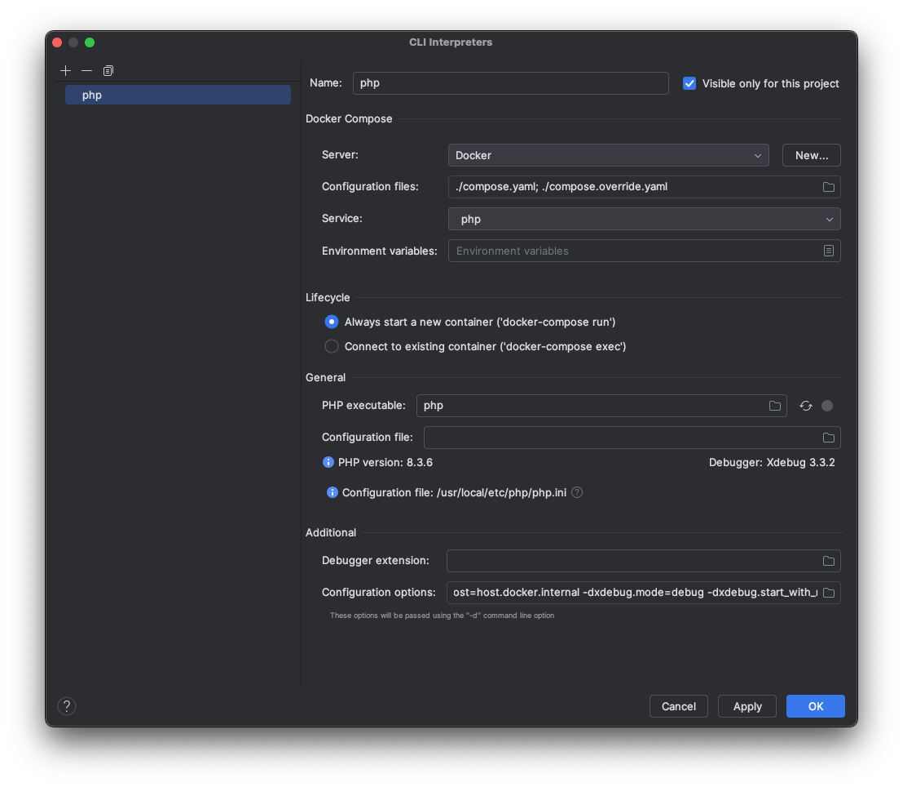
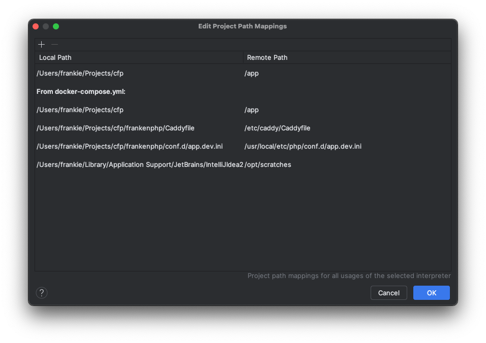
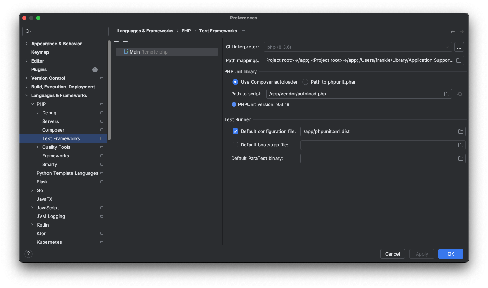

A raíz de una pregunta sobre Vertical Slice Architecture estaba intentando empezar a escribir una pequeña aplicación para investigar la propuesta y voy a tratar de documentar el proceso.

Por las razones que sea, quise empezar el proyecto en PHP, usando Symfony. Este es el framework PHP que más me convence y por eso es mi primera opción.

## Primer intento: entorno docker e instalar symfony después

Spoiler: sale mal.

Cuando tengo que montar un entorno docker suelo usar [PHPDocker.io](https://phpdocker.io/). No me emociona usar una instalación local y tener entornos variados de PHP para distintas finalidades en docker es relativamente sencillo.

Hasta ahí todo bien. El problema es que instalar Symfony en este contexto concreto necesita cierta planificación previa. Symfony requiere que la carpeta destino esté vacía para hacer sus cosas. Esto no ocurre porque la carpeta creada por PHPDocker.io contiene cosas (Dockerfiles, archivos de configuración, docker-compose y demás).

En resumen, esto quiere decir que no puedes saltar al shell del contenedor e iniciar el proyecto de symfony.

La solución que se me ha ocurrido a posteriori es la de iniciar el proyecto Symfony primero, usando la herramienta `symfony` y un `composer` local. A continuación, mezclar el contenido del proyecto PHPDocker.io para dockerizar el entorno.

## Segundo intento: el docker Symfony de Kévin Dunglas

La siguiente solución es usar el [Symfony dockerizado](https://github.com/dunglas/symfony-docker) de Kévin Dunglas, que es una solución un poco sobredimensionada para mis propósitos, pero que podrías usar en producción incluso.

La ventaja es que es básicamente seguir las instrucciones y ya está. Descargas el zip, descomprimes la carpeta, le das el nombre que quieras y prácticamente no tienes más que abrirla en tu IDE. Al menos para empezar.

## Configurando el entorno de trabajo

Yo uso desde hace años IntelliJ IDEA. Empecé con PHPStorm, pero con el tiempo y mi interés en probar otros lenguajes, decidí pasarme a IDEA Ultimate para tenerlo todo en el mismo sitio. No hay prácticamente diferencias entre IDEA y las versiones adaptadas a un lenguaje de los IDE de IntelliJ. Y si, como es mi caso, te mueves entre 4 ó 5 lenguajes, diría que merece la pena.

Se podría argumentar que si tengo que cambiar de IDE algún día me veré en problemas. Y la verdad es que ya me ha pasado tener que usar algún otro IDE, y obviamente la sensación de desorientación es enorme.

### Iniciando el proyecto

Las instrucciones del docker Symfony dicen que hagas esto:

* Instalar Docker Compose (v2.10+) si no lo tienes.
* Ejecutar `docker compose build --no-cache` crear las imágenes.
* Ejecutar `docker compose up --pull always -d --wait` para levantar y arrancar el proyecto.
* Abrir https://localhost y aceptar el certificado TLS autogenerado.
* Para parar los contenedores `docker compose down --remove-orphans`.

Con ello se levanta el entorno docker y se instala la última versión de Symfony. Es posible personalizar esto, pero no es el objetivo del artículo.

Una vez hecho esto, lo suyo es abrir el proyecto en IntelliJ o PHPStorm con `File > New... > Project from Existing Sources...`.

Yo lo hice antes de levantar el docker, por lo que, de entrada, el IDE no identifica el tipo que es. No supone ningún problema, de hecho. Solo es un poco más de trabajo: empieza marcando las carpetas del proyecto: `src` como _Sources Root_, así como `.idea` y `vendor` como `Excluded`, etc.

En la documentación del proyecto puedes encontrar un ejemplo de `Makefile`, que yo recomendaría copiar tal cual, ya que facilitar hacer algunas tareas de mantenimiento, gestión del contenedor, entrar al shell, etc.

Por último, inicia `git` en el proyecto con `git init`. Este incluye un `.gitignore` bastante completo, pero verifica si necesitas añadir alguna cosa más. Yo siempre pongo la carpeta `/.idea` y el archivo de proyecto `*.iml`, pero esto ya es una preferencia personal. Hay quien prefiere dejarlos, o quien los añade al `git/exclude`.

Una vez integrado con `git`, puedes ir guardando hitos del proyecto.

### Testing

Aunque el docker está muy bien no acabo de entender que no instale el entorno de testing por defecto. De hecho, no es buena idea instalarlo a mano porque se pega un poco con Symfony (esto es algo que me molesta un poco).

En cualquier caso, se trata de hacer un `composer require --dev symfony/phpunit-bridge` y todo se prepara solo.

### Configurando el IDE

La configuración del IDE para trabajar en el proyecto debería ser fácil, pero tiene dos o tres puntos que siempre se me atragantan y por eso estoy escribiendo este artículo.

Para trabajar eficientemente necesito tener bien configurado e integrado en el IDE, el lenguaje, los tests y el depurador. Eso como mínimo, pues normalmente acabo añadiendo más herramientas como PHPStan, Code Sniffer y otras.

**PHP**: Empezamos yendo a `Settings > Languages & Frameworks >  PHP` para configurar el intérprete PHP. Este será Remoto, usando Docker e indicándole al IDE los archivos docker-compose necesarios.

Nuestro proyecto docker llama a estos archivos `compose.yaml`, `compose.prod.yaml` y `compose.override.yaml`. Para nuestro objetivo debería ser suficiente como `compose.yaml` y `compose.override.yaml`.

En principio yo suelo preferir que el IDE se conecte a un contenedor que esté corriendo (mediante `exec`), pero si no estuviese levantado protestará, por lo que puedes empezar con el modo de levantar nuevo contenedor (`run`).

Ahora, una cosa que no he visto muy documentada, pero explica y soluciona montones de problemas _inexplicables_. Hablemos de `File Mappings`.

Los `File Mappings` mapean o relacionan una carpeta (o archivo) en tu sistema de archivos local con el sistema de archivos del contenedor. De esta forma, el IDE sabe traducirlos según sea necesario.

En la sección correspondiente de configuración de PHP verás que automática y convenientemente se han extraído varios mapeos y son todos correctos. Sin embargo, por algún motivo que ignoro, hay bastantes situaciones en las que el IDE no se entera. ¿Solución? Añade manualmente el mapeo de la raíz del proyecto. De hecho, ya está en la lista extraída del `docker-compose`, pero como he dicho, por algún motivo no funciona.

Si todo va bien, deberías ver en el mismo diálogo las versiones de PHP y Xdebug.

**Test frameworks**: Una cosa que adoro en los IDE es la integración de los tests. No me emociona tirarlos desde la terminal, especialmente si solo quiero ejecutar uno específico. En fin, manías personales aparte, Hay que ir a `Settings > Languages and Frameworks > PHP > Test Framewors`. En este caso, se trata de configurar PHPUnit usando el PHP CLI que hemos definido antes. Nada del otro jueves y suele funcionar a la primera.

Tres cosas que has de tener en cuenta para prevenir los problemas más comunes:

* Asegúrate de haber instalado `phpunit` con `composer`. Si no está `phpunit`, nunca lo va a encontrar el IDE.
* La ruta al autoloader del proyecto (si lo configuras así) es la **del interior del contenedor**. En mi caso: `/app/vendor/autoload.php`.
* Es muy probable que tengas que indicarle al IDE que el archivo de configuración de phpunit por defecto es: `/app/phpunit.xml.dist` (o el que hayas preparado al efecto).

En algunos casos, dependiendo del proyecto puedo querer usar Behat, que en principio tampoco tiene muchas fantasías para ponerlo a funcionar. Aunque configurarlo como me gusta es otra historia que creo haber explicado en alguna otra parte.

**Depurador**: Donde siempre tropiezo una y otra vez es con la integración de XDebug y este proyecto no iba a ser una excepción. Es muy raro que yo haga pruebas en local de los proyectos, por lo que normalmente no configuro el depurador para trabajar en el navegador y tal. Si llega el caso, ya veremos.

En su lugar, me obsesiona que tener el depurador para ejecutar los tests desde el IDE. Casi todo mi proceso lo requiere y, sin embargo, configurarlo es algo que raras veces consigo a la primera.

En el caso de este docker de Symfony, Xdebug viene deshabilitado por defecto. Para activarlo tendrías que poner la variable de entorno `XDEBUG_MODE=debug`. La mejor forma de hacerlo es añadirlo en la _Template_ de PHPUnit en las configuraciones de ejecución (menú `Run`), de este modo dispondrás del depurador al ejecutar cualquier test.

## Finalizando

Si no se me ha escapado nada, estos son los pasos que suelo seguir para comenzar a trabajar en un proyecto PHP. En este caso, además es un proyecto con Symfony. Dejando aparte las peculiaridades de este `docker/Symfony` que he comentado aquí, una vez que tengo el entorno con PHP y tal la configuración del IDE es la que suelo usar.

Como digo, muy raramente hago pruebas en el entorno local y casi todo va por tests, por lo que me importa mucho que todos estos elementos se integren y funcionen bien juntos.

Por otra parte, al respecto del proyecto de Vertical Slice Architecture y como afecta a la configuración de rutas en Symfony, quizá le dedique otro artículo.

Los frameworks son paquetes de decisiones tomadas por alguien que no sabe nada de nuestros proyectos, por lo que nunca uso directamente la estructura que propone, sino que adapto el framework para trabajar con la que me interesa para mis objetivos.
