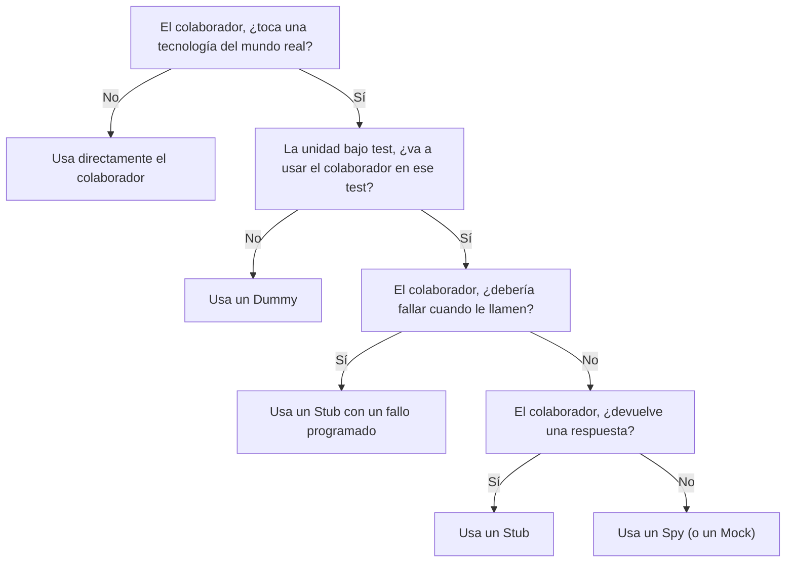

En este artículo vamos a explicar todo lo que necesitas saber para utilizar dobles en tus tests.

Para empezar, tenemos que tocar algunas cuestiones teóricas, algo por lo que no me voy a disculpar, pues son imprescindibles para usar correctamente y beneficiarse del uso de dobles. Finalmente, veremos como abordar un caso que nos requiere utilizar distintos tipos de doble para abordar el testeo de un servicio.

Aquí tienes el índice del artículo, por si prefieres saltar directamente a alguno de los puntos:

<!-- TOC -->
  * [Deja de llamarlos Mocks](#deja-de-llamarlos-mocks)
  * [Principios de diseño y dobles de test](#principios-de-diseño-y-dobles-de-test)
  * [Dobles de test](#dobles-de-test)
    * [Cuando testeamos queries](#cuando-testeamos-queries)
      * [Stub](#stub)
      * [Fake](#fake)
    * [Cuando testeamos comandos](#cuando-testeamos-comandos)
      * [Dummy](#dummy)
      * [Spy](#spy)
      * [Mock](#mock)
  * [¿Cómo influye un colaborador en el comportamiento de la unidad bajo test?](#cómo-influye-un-colaborador-en-el-comportamiento-de-la-unidad-bajo-test)
  * [Test doble: ¡te elijo a ti!](#test-doble-te-elijo-a-ti)
  * [Patrones de uso y buenas prácticas](#patrones-de-uso-y-buenas-prácticas)
  * [Anti-patrones o smells en el uso de dobles](#anti-patrones-o-smells-en-el-uso-de-dobles)
  * [Un caso práctico: el servicio de felicitación de cumpleaños](#un-caso-práctico-el-servicio-de-felicitación-de-cumpleaños)
    * [Inversión de Dependencias: Customers](#inversión-de-dependencias-customers)
    * [Introducción de un Stub de Customers](#introducción-de-un-stub-de-customers)
    * [Espiando el side-effect](#espiando-el-side-effect)
    * [Un nuevo Stub para Customers](#un-nuevo-stub-para-customers)
    * [El colaborador que no hacía nada](#el-colaborador-que-no-hacía-nada)
    * [Verificando que se envía el mensaje correcto](#verificando-que-se-envía-el-mensaje-correcto)
  * [Conclusiones](#conclusiones)
<!-- TOC -->

Y puedes encontrar el [código en este repositorio: birthday-service-kata](https://github.com/franiglesias/birthday-service-kata).

## Deja de llamarlos Mocks

Lo primero de todo es un tema de _nomenclatura_. Deja de llamar _Mocks_ a todos los dobles de test. Los dobles de test pueden ser _dummies_, _stubs_, _fakes_, _spies_ o _mocks_. _Mock_ no solamente es un tipo específico de doble de test, sino uno del que no vamos a hablar mucho en este artículo, porque puedes vivir sin él en la mayor parte de los casos.

## Principios de diseño y dobles de test

Para entender y manejar bien los dobles de test necesitas recurrir a varios principios y patrones de diseño de software y testing:

* **Separación Command-Query**: Este principio nos dice que toda función (o método de un objeto) puede ser o bien un comando, que produce un efecto, o cambio, en el sistema, o bien una query (pregunta), que obtiene y nos devuelve una información del mismo sistema. Pero no puede hacer ambas cosas a la vez. Es decir, un comando no puede devolver una respuesta, ni una query puede provocar un cambio en el sistema. Este principio nos servirá para saber qué vamos a verificar y que tipo de dobles de test podríamos necesitar.
* **Composición**: El principio de composición nos dice que el comportamiento de un objeto es el resultado de la composición de los comportamientos de sus colaboradores. Sabiendo esto, en situaciones de test, debemos decidir si necesitamos aislar al sujeto del test de sus colaboradores, especialmente cuando su efecto tiene un coste en performance, en dificultad de testear o incluso en la posiblidad de hacerlo.
* **Black-box testing**: Es el tipo de testing que se basa en observar la respuesta devuelta por la unidad bajo test o bien el efecto que ha provocado en el sistema. Se asume que no conocemos la implementación de esa unidad bajo test y solo examinamos sus efectos, por eso decimos que es una caja negra o **black box**.
* **White-box testing**: En este tipo de testing usamos nuestro conocimiento de la implementación de la unidad bajo test para decidir como abordamos las pruebas. Por ejemplo, analizando los flujos de ejecución para decidir qué casos vamos a testear, o bien haciendo aserciones sobre los mensajes que la unidad bajo test y sus colaboradores se pasan.
* **Principio de Inversión de Dependencias**: El principio de inversión de dependencias nos dice que siempre deberíamos depender de abstracciones (interfaces) y nunca de implementaciones. Esto nos permite introducir implementaciones alternativas a las que usamos en producción en los entornos de test.
* **Segregación de Interfaces**: Este principio nos pide diseñar interfaces estrechas (que tengan pocos métodos) a partir de las necesidades de sus consumidores. Cuantos menos métodos tenga la interfaz más fácil será implementar dobles de test.
* **Inyección de dependencias**: La inyección de dependencias es el patrón por el cual pasamos las dependencias a los objetos que las necesitan en lugar de que sean ellos quienes las instancien. De este modo, podemos explotar, entre otros, el principio de Inversión de Dependencias y utilizar nuestros dobles.
* **Fail fast**: Este principio nos dice que todo módulo que tiene un error debe comunicarlo inmediatamente al módulo que lo haya llamado, el cual tendrá el contexto para tomar la decisión de qué se ha de hacer con el error. Esto nos permite, entre otras cosas, simular fácilmente errores en situaciones de test.

## Dobles de test

Y, por fin, definamos lo que es un doble de test.

Un doble de test es un objeto que reemplaza un colaborador o dependencia de la unidad bajo de test de forma que podamos controlar su influencia en el comportamiento que estamos testeando. Sobre esto último hablaremos dentro de un momento.

En general, utilizaremos dobles de tests para reemplazar aquellas dependencias que suponen un coste, o un obstáculo, para la ejecución del test. Lo normal es que estas dependencias tengan que ver con tecnologías específicas que hemos usado para implementar nuestro sistema.

* Bases de datos de cualquier tipo.
* Servicios de terceros a través de una conexión de red.
* Servicios intrínsecamente lentos.
* Servicios que puedan producir resultados no deterministas, que usualmente dependen de la máquina en la que se ejecuta el código.
* Otros.

A continuación, permítime presentarte a los distintos tipos de doble.

### Cuando testeamos queries

Cuando testeamos una _query_ vamos a examinar el resultado que devuelve. En caso de necesitar un doble porque tenemos alguna dependencia –típicamente una base de datos o una API de terceros– usaremos principalmente _Stub_ y _Fake_. Vamos a conocerlos:

#### Stub

Un _Stub_ es un objeto que puede reemplazar a una dependencia y que siempre devuelve una respuesta conocida. Esta respuesta puede:

* **Estar pre-programada (hardcoded)**: el método suplantado devuelve siempre el mismo valor.
* **Ser configurable**: al construir el stub le pasamos lo que queremos que devuelva.
* **Fallar**: el método suplantado falla de una forma determinada que nos interesa controlar. Nuestro objetivo es verificar el comportamiento de la unidad bajo test en caso de que esa dependencia falle de esa manera particular.

#### Fake

Un _Fake_ es un objeto que implementa un comportamiento definido por una interfaz pero sin el coste de usar una tecnología del mundo real. Si además de eso, puede pasar los mismos tests que le haríamos a esa implementación real, estaríamos hablando de un _Fake Verificado_ que, de hecho, podríamos llegar a usar en producción. El ejemplo más típico es un repositorio implementado en memoria.

Los _Fakes_ introducen mucho riesgo si no son verificados. Y en ese caso, pueden introducir gran complejidad. Por tanto, es un tipo de doble que tendremos que usar con precaución.

### Cuando testeamos comandos

Cuando testeamos comandos estamos interesadas en verificar que se haya producido un cierto efecto en el sistema. Por desgracia no siempre es posible o conveniente comprobar este efecto.

Por ejemplo, si la unidad bajo test tiene que generar un archivo, siempre podríamos verificarlo examinando el sistema de archivos y cargándolo para ver si su ubicación y contenido son correctos. Esto es relativamente fácil, pero estos tests en el entorno de CI pueden ser una fuente de errores. Además, tienen un efecto sobre la velocidad de ejecución de los tests.

Otro ejemplo de comando podría ser el envío de una notificación por email, SMS, Slack o servicio similar. Verificar que un destinatario específico ha recibido esa notificación con el formato y contenido adecuado es, por lo general, impracticable. En su lugar, lo que verificamos es si hemos hecho uso del colaborador adecuado, pasándole la notificación correcta.

El tipo de dobles de test que usamos en esos casos suelen ser _Dummies_, _Spies_ y _Mocks_.

#### Dummy

Aunque pueda parecer paradójico, el _Dummy_ es un doble de test que usamos cuando no queremos llamar al colaborador. O dicho de otra forma, usamos un _Dummy_ cuando no esperamos que ese colaborador u objeto llegue a usarse, pero lo necesitamos para satisfacer una interfaz.

Los métodos del _Dummy_ devuelven `null` o directamente fallan, en ese sentido un _Dummy_ es como un _Stub_, pero la respuesta no es la propia de su rol, pues se trata de un simple chivato. En ambos casos, el test debería fallar en caso de que usemos el objeto (repito, cuando esperamos no usarlo).

#### Spy

Un objeto espía es un objeto que reemplaza a la dependencia o colaborador original con el objetivo de recabar información interna de lo que pasa dentro de la unidad bajo test. Su trabajo es tomar nota de las veces que ha sido llamado o de los parámetros de esas llamadas. Y podríamos añadir que debe de hacerlo sin levantar sospechas.

De este modo, una vez que ha terminado la ejecución de la unidad bajo test, no tenemos más que preguntarle al espía sobre la información de nuestro interés y con eso crear nuestras aserciones.

#### Mock

Y llegamos por fin al _Mock_. El trabajo de un _Mock_ es básicamente igual que el del espía, pero en lugar de pasar desapercibido queremos que monte un escándalo en caso de que no se use como esperamos, y eso sin que finalice la ejecución. Es decir, en el momento en el que el _Mock_ detecta que algo no le cuadra, como que le pasan un parámetro que no es el que espera, tiene que lanzar un fallo y provocar que el test no pase. Así que se podría decir que los _Mocks_ llevan implícitas las aserciones.

El caso es que tanto Spies como _Mocks_ verifican la forma en que la unidad bajo test se comunica con el colaborador doblado y esto añade fragilidad al test.

## ¿Cómo influye un colaborador en el comportamiento de la unidad bajo test?

Puede hacerlo de cuatro maneras:

**No haciendo nada**. En algunas circunstancias el colaborador no hace nada que afecte al comportamiento de la unidad bajo test (esta no se comunica con él). Y en algunos casos el efecto que tiene no nos preocupa. Ejemplos:

* Se le pasa un objeto a la unidad bajo test (o esta lo obtiene de otro colaborador) y simplemente se lo pasa a otro sin utilizarlo.
* En una situación de test, por las razones que sea, ese colaborador no llega a usarse, porque no hay nada que procesar o porque un paso anterior falla y nunca se llega a ese colaborador.
* Un _Logger_ es un caso típico de un colaborador que se usa, pero del cual no nos preocupa normalmente el efecto que pueda tener en el test.

Este es el caso de uso de un _Dummy_.

**Devolviendo algo**. Con mucha frecuencia, un colaborador influye en el comportamiento produciendo algún resultado que la unidad bajo test necesita para poder completar su trabajo.

Este es el caso de uso de un _Stub_.

**Recibiendo un mensaje para producir un efecto**. Esto ocurre específicamente en los _commands_. Un colaborador recibe un mensaje de la unidad bajo test para que produzca un cambio en el sistema, que es lo que esperamos que suceda. Este cambio puede ser lo bastante costoso como para no querer que se produzca en la situación de test.

Este es el caso de uso de un _Spy_. También de un _Mock_, pero ¿para qué usar _Mocks_ teniendo espías?

**Fallando**. Todos los colaboradores que puedan tener algún motivo para fallar lo harán alguna vez, por lo que debemos prepararnos para gestionar ese error.

Este es el caso de uso de _Stub_ con un fallo programado.

## Test doble: ¡te elijo a ti!

Podemos seguir el sistema a continuación para escoger el test doble adecuado. Una vez identificado el colaborador que queremos sustituir, iremos haciendo las siguientes preguntas:

* El colaborador, ¿toca una tecnología del mundo real?.
  * **No**: usa directamente el colaborador.
  * Sí: pasa a la siguiente pregunta.
* La unidad bajo test, ¿va a usar el colaborador en ese test?
  * **No**: usa un _Dummy_
  * Sí: pasa a la siguiente pregunta.
* El colaborador, ¿debería fallar cuando le llamen?
  * **Sí**: usa un _Stub_ con un fallo programado.
  * No: pasa a la siguiente pregunta.
* El colaborador, ¿devuelve una respuesta?
  * **Sí**: usa un _Stub_.
  * **No**: usa un _Spy_ (o un _Mock_)

O si lo prefieres, utiliza este gráfico creado por [Dídac Ríos](https://www.linkedin.com/in/didacrios/) usando Mermaid.



## Patrones de uso y buenas prácticas

Es importante reconocer que la función de los dobles de test es reemplazar colaboradores de la unidad bajo test de tal manera que nos permitan controlar su comportamiento de forma que sea predecible y económico en términos de performance y recursos.

En ese sentido, los dobles de tests se sitúan en esa frontera en la que tocamos tecnologías del mundo real, una frontera que los tests no deben traspasar.

Es recomendable **escribir tus propios dobles de test** y no usar librerías para ello. Las librerías pueden ser cómodas en algunos contextos, pero en la mayor parte de los casos no son necesarias y contribuyen a abusar de dobles excesivamente complejos.

En general, **prefiere test sociales**. Los tests sociales son aquellos en los que la unidad bajo test no es una única función o clase, sino que puede incluir colaboradores reales. Los dobles solo se usarían cuando tocamos tecnologías concretas o servicios que producen respuestas no deterministas (como el reloj del sistema o el generador aleatorio). Es decir, cuando tendríamos que cruzar alguna frontera.

**No dobles lo que no poseas**. Es recomendable no doblar directamente librerías de tercera parte. Para hacer esto no te quedaría más remedio que usar librerías de dobles o librerías de mocks. En su lugar, introduce una abstracción y aplica el patrón Adaptador para utilizar la librería. En los tests, haz un doble basado en la abstracción.

Recuerda que los _Spies_ y los _Mocks_ introducen fragilidad en los tests, por lo que debes usarlo todo para testear únicamente el efecto deseado. Y, por supuesto, nunca los utilices cuando hagas tests de queries.

## Anti-patrones o smells en el uso de dobles

En mi experiencia, he identificado tres anti-patrones o smells cuando se usan dobles de test:

**Doble reutilizado**. Aunque hay algunos casos en los que se puede reutilizar el mismo doble, esto introduce el riesgo de añadir complejidad y acoplamiento entre distintos tests. Por ejemplo, si tenemos que añadir alguna lógica en el doble que depende del test en el que se vaya a utilizar.

Como regla general, intenta introducir los dobles necesarios para el test específico en el que estás interesada. Es preferible una cierta duplicación de lógica trivial que el riesgo de acoplamiento y complejidad en los tests.

**Doble sabihondo**, Esto ocurre cuando se introduce mucho conocimiento de dominio en el doble. Es decir, cuando ponemos lógica en el doble basada en la misma lógica de dominio que tiene el colaborador original. En el caso de los _Stubs_, siempre debes simular el mínimo: devolver un valor conocido, sin ninguna lógica que lo calcule.

**Demasiadas expectativas**. He visto muchos tests en las que se establecen expectativas sobre todas y cada una de las llamadas que hace la unidad bajo test a sus colaboradores, independientemente de si es un efecto esperado o de si se trata simplemente de un _Stub_. Esto introduce muchas fuentes potenciales de fallo del test que no tienen que ver con el comportamiento que se está observando.

Esto es debido, sobre todo, a un mal uso de las librerías de dobles y el abuso de _Mocks_. Es mucho mejor usar espías y centrarse en el efecto que ese test está verificando.

## Un caso práctico: el servicio de felicitación de cumpleaños

El siguiente es un ejercicio que he diseñado para practicar la introducción de dobles de test. En el ejercicio presentamos un servicio que obtiene los clientes que cumplen años en una fecha dada y les envía un email que incluye un código de descuento generado al vuelo.

Se incluye el esqueleto de un par de tests que hay que terminar, dado que ninguno verifica que se produzca el efecto deseado y que no es otro que se hayan enviado tantos emails como clientes cumpliendo años ese día. Además, habría que añadir al menos un tercer test que compruebe que el mensaje se construye correctamente y se envía al destinatario esperado.

```typescript
/*
 * README
 * Exercise:
 * We have a BirthdayService that runs every day via a cron job
 *
 *  It greets customers with has birthday on that day.
 *  It generates a discount code for them.
 *  It sends an email to them with the discount code.
 *  It logs the email sent.
 *
 * You work is to write the required tests for this functionality.
 * You probably will need to modify the code to make it testable.
 * Use different test doubles for the dependencies.
 *
 * Start by running the test below and fixing the errors.
 * Add assertions to the test that matches the intent of the test.
 *
 * Maybe you need to apply some refactorings to make the code testable in line with the Small Safe Steps workshop.
 *
 * Enrich the exercise by adding more tests:
 *
 * * Make a test to ensure that the service sends the correct email content to the right customer
 * * Make a test to ensure that the service fails gracefully if the email sending fails
 * * Make a test to ensure that the service fails gracefully if the repository fails
 *
 * */

describe('Birthday greetings', () => {
    it('should not send greeting emails if no customer has birthday today', () => {
        const service = new BirthdayService(
            new Customers([]),
            new ProductionEmailSender(),
            new ProductionLogger(),
        )
        service.greetCustomersWithBirthday(new Date())
    })

    it('should send greeting emails to all customers with birthday today', () => {
        const service = new BirthdayService(
            new Customers([
                new Customer('John Doe', 'john@example.com', new Date('1990-02-14')),
                new Customer('Jane Doe', 'jane@example.com', new Date('2005-02-14')),
            ]),
            new ProductionEmailSender(),
            new ProductionLogger(),
        )

        service.greetCustomersWithBirthday(new Date())
    })
})
```

Cuando intentamos ejecutar el test ocurre lo siguiente:

```
Error: 🤦🏽‍♀️ You are using ProductionCustomerRepository in a test. It will mess up our data.
```

Tal como está escrito el test, se están usando los colaboradores reales. Aun asumiendo que se trata de un entorno de desarrollo local, estaríamos pagando una penalización de rendimiento en el test, por no hablar de la necesidad de preparar la base de datos con una muestra adecuada de registros.

Vamos a centrarnos en el primer test:

```typescript
it('should not send greeting emails if no customer has birthday today', () => {
    const service = new BirthdayService(
        new Customers([]),
        new ProductionEmailSender(),
        new ProductionLogger(),
    )
    service.greetCustomersWithBirthday(new Date())
})
```

En este primer test suponemos que no se encuentra ningún cliente que cumpla años en el día de hoy, por lo que no se esperaría enviar ningún mensaje. Lo propio sería comprobar que `ProductionEmailSender` no ha recibido llamadas, por lo que tendríamos que sustituirlo por un espía. Y, antes de eso, tenemos que usar un `Customers` que no sea una implementación de producción. Tenemos bastante trabajo por delante y lo primero sería ver qué pasa dentro de `BirthdayService`:

```typescript
export class BirthdayService {
  private readonly customerRepository: Customers
  private readonly emailSender: ProductionEmailSender
  private readonly logger: ProductionLogger

  constructor(
          customerRepository: Customers,
          emailSender: ProductionEmailSender,
          logger: ProductionLogger,
  ) {
    this.customerRepository = customerRepository
    this.emailSender = emailSender
    this.logger = logger
  }

  greetCustomersWithBirthday(today: Date) {
    const customers = this.customerRepository.findWithBirthday(today)
    customers.forEach((customer) => {
      const discountCode = new DiscountCodeGenerator().generate()
      const template =
              'Happy birthday, {name}! Here is your discount code: {discount}'.replace(
                      '{discount}',
                      discountCode.getCode(),
              )
      customer.sendEmail(template, this.emailSender)
      this.logger.log('INFO', customer.fillWithEmail('Email sent to {email}'))
    })
  }
}
```

Lo primero que hace `BirthdayService` es invocar el `findWithBirthday` de su colaborador `customerRepository`, que es de tipo `Customers`. Luego itera la colección de `Customer`, pero como en este primer ejemplo tal colección está vacía podemos despreocuparnos de momento.

Esperaríamos que `Customers` fuese una abstracción... Pero no. Es una implementación concreta y no existe ninguna abstracción.

```typescript
export class Customers {
  private readonly customers: Customer[]

  constructor(customers: Customer[]) {
    this.customers = customers
  }

  findWithBirthday(today: Date): Customer[] {
    throw new Error(
            '🤦🏽‍♀️ You are using ProductionCustomerRepository in a test. It will mess up our data.',
    )
  }
}
```

### Inversión de Dependencias: Customers

Por tanto, nuestro primer objetivo es que se aplique el _Principio de Inversión de Dependencias_. Para ello, hay que introducir una interfaz, hacer que `BirthdayService` depende de ella y así poder reemplazar el servicio `Customers` por un doble de test.

En mi caso, lo primero que hago es cambiar el nombre de `Customers` por `ProductionCustomers`, de este modo dejo claro que se trata de una implementación. Además `Customers`, me parece un nombre mejor para la interfaz.

Usando _IntelliJ_ es posible usar los refactors automáticos, _Rename_ y _Extract Interface_, por lo que no me preocupa que los tests no estén pasando.

El cambio de nombre:

```typescript
export class ProductionCustomers {
  private readonly customers: Customer[]

  constructor(customers: Customer[]) {
    this.customers = customers
  }

  findWithBirthday(today: Date): Customer[] {
    throw new Error(
            '🤦🏽‍♀️ You are using ProductionCustomerRepository in a test. It will mess up our data.',
    )
  }
}
```

La interfaz:

```typescript
export interface Customers {
  findWithBirthday(today: Date): Customer[]
}
```

Por último, tenemos que hacer que BirthdayService dependa de Customers:

```typescript
export class BirthdayService {
  private readonly customerRepository: Customers
  private readonly emailSender: ProductionEmailSender
  private readonly logger: ProductionLogger

  constructor(
          customerRepository: Customers,
          emailSender: ProductionEmailSender,
          logger: ProductionLogger,
  ) {
    this.customerRepository = customerRepository
    this.emailSender = emailSender
    this.logger = logger
  }

  greetCustomersWithBirthday(today: Date) {
    // Removed for clarity
  }
}
```

### Introducción de un Stub de Customers

Ahora que ya tenemos la dependencia invertida es sencillo introducir un doble de test adecuado para este test. En nuestro caso, lo que queremos es una implementación de la interfaz `Customers` que devuelva una colección vacía de objetos `Customer`, por tanto, vamos a introducir un _Stub_.


```typescript
class NoBirthdayTodayCustomers implements Customers {
  findWithBirthday(_: Date): Customer[] {
    return []
  }
}
```

E inyectarlo en el servicio para el caso del test:

```typescript
it('should not send greeting emails if no customer has birthday today', () => {
  const service = new BirthdayService(
          new NoBirthdayTodayCustomers(),
          new ProductionEmailSender(),
          new ProductionLogger(),
  )
  service.greetCustomersWithBirthday(new Date())
})
```

Y con este cambio ya se puede ejecutar el test. Si examinamos el código podemos ver que debido a que en este caso de test no tenemos elementos en la colección, el bucle nunca se ejecuta y no se llaman a los otros colaboradores.

```typescript
export class BirthdayService {
  private readonly customerRepository: Customers
  private readonly emailSender: ProductionEmailSender
  private readonly logger: ProductionLogger

  constructor(
          customerRepository: Customers,
          emailSender: ProductionEmailSender,
          logger: ProductionLogger,
  ) {
    this.customerRepository = customerRepository
    this.emailSender = emailSender
    this.logger = logger
  }

  greetCustomersWithBirthday(today: Date) {
    const customers = this.customerRepository.findWithBirthday(today)
    customers.forEach((customer) => {
      const discountCode = new DiscountCodeGenerator().generate()
      const template =
              'Happy birthday, {name}! Here is your discount code: {discount}'.replace(
                      '{discount}',
                      discountCode.getCode(),
              )
      customer.sendEmail(template, this.emailSender)
      this.logger.log('INFO', customer.fillWithEmail('Email sent to {email}'))
    })
  }
}
```

### Espiando el side-effect

De todos modos, nuestro test está incompleto porque no se realiza ninguna comprobación. Es hora de introducirla. En este caso el comportamiento esperado es que no se hagan llamadas al `ProductionEmailSender`, y para ello necesitamos introducir un espía al que podamos preguntarle cuantas veces le hemos pedido que envíe emails.

Por supuesto, `ProductionEmailSender` es una implementación concreta, así que vamos a ver qué podemos hacer:

```typescript
export class ProductionEmailSender implements EmailSender {
  send(email: string, message: string) {
    throw new Error(
            '🤬 You are using ProductionEmailSender in a test. It will cost lots of money $$.',
    )
  }
}
```

Por suerte, `ProductionEmailSender` implementa una interfaz `EmailSender`, aunque `BirthdayService` todavía depende de la implementación. Así que tenemos que completar la inversión:

```typescript
export class BirthdayService {
  private readonly customerRepository: Customers
  private readonly emailSender: EmailSender
  private readonly logger: ProductionLogger

  constructor(
          customerRepository: Customers,
          emailSender: EmailSender,
          logger: ProductionLogger,
  ) {
    this.customerRepository = customerRepository
    this.emailSender = emailSender
    this.logger = logger
  }

  greetCustomersWithBirthday(today: Date) {
    // Removed for clarity
  }
}
```

Esto nos permitirá plantear el test de esta forma:

```typescript
it('should not send greeting emails if no customer has birthday today', () => {
  const emailSender = new MessageCountingEmailSender()
  const service = new BirthdayService(
          new NoBirthdayTodayCustomers(),
          emailSender,
          new ProductionLogger(),
  )
  service.greetCustomersWithBirthday(new Date())

  expect(emailSender.countOfSentEmails()).toBe(0)
})
```

Lo que estamos haciendo es introducir una implementación de `EmailSender` que sea capaz de contar la cantidad de veces que se invoca el método `send` y al que le podamos preguntar una vez que se ha ejecutado el servicio.

```typescript
class MessageCountingEmailSender implements EmailSender {
  private msgSent: number = 0
  send(email: string, message: string): void {
    this.msgSent++
  }

  countOfSentEmails(): number {
    return this.msgSent
  }
}
```

Obviamente como el bucle no se ejecuta el contador de mensajes no va a registrar ninguno, así que el test pasa. Podemos verificar que el test es válido porque si cambiamos la línea de `expect` para probar otros valores, el test falla.

Con esto, podemos dar por terminado este test y pasar al siguiente.

### Un nuevo Stub para Customers

Para ejecutar el segundo test necesitaremos un _Stub_ que nos entregue una colección de `Customer`. En este caso, vamos a hacer que tenga una cierta capacidad de configuración:

```typescript
class CustomersWithBirthdayToday implements Customers {
  private customers: Customer[]
  constructor(customers: Customer[]) {
    this.customers = customers
  }

  findWithBirthday(_: Date): Customer[] {
    return this.customers
  }
}
```

Y lo usamos en el test:

```typescript
  it('should send greeting emails to all customers with birthday today', () => {
  const service = new BirthdayService(
          new CustomersWithBirthdayToday([
            new Customer('John Doe', 'john@example.com', new Date('1990-02-14')),
            new Customer('Jane Doe', 'jane@example.com', new Date('2005-02-14')),
          ]),
          new ProductionEmailSender(),
          new ProductionLogger(),
  )

  service.greetCustomersWithBirthday(new Date())
})
```

Al ejecutar el test nos encontramos con este mensaje. Si bien hemos cambiado `ProductionCustomers` por su doble, no lo hemos hecho todavía con `ProductionEmailSender`, por lo que el test fallará:

```
Error: 🤬 You are using ProductionEmailSender in a test. It will cost lots of money $$.
```

En nuestro caso, podemos empezar usando el mismo espía que usamos en el otro test, ya que este segundo test se basa igualmente en la cuenta de mensajes:

```typescript
it('should send greeting emails to all customers with birthday today', () => {
  const emailSender = new MessageCountingEmailSender()
  const service = new BirthdayService(
          new CustomersWithBirthdayToday([
            new Customer('John Doe', 'john@example.com', new Date('1990-02-14')),
            new Customer('Jane Doe', 'jane@example.com', new Date('2005-02-14')),
          ]),
          emailSender,
          new ProductionLogger(),
  )

  service.greetCustomersWithBirthday(new Date())

  expect(emailSender.countOfSentEmails()).toBe(2)
})
```

### El colaborador que no hacía nada

Ahora, al ejecutar el test, cambia el error:

```
Error: ️😱 You are using ProductionLogger in a test. It will increase our bills by zillions $$.
```

Necesitamos suplantar `ProductionLogger` con un doble. Nosotras usaremos un _Dummy_ porque, si bien necesitamos una instancia de `ProductionLogger` para poder instanciar el propio `BirthdayService`, no tiene influencia en su comportamiento.

Si estudiamos la implementación actual de `ProductionLogger` podemos ver que es una clase concreta, por lo que lo mejor sería introducir una abstracción, invertir la dependencia y así tener vía libre para crear un doble de test.

```typescript
export class ProductionLogger {
  log(level: string, message: string) {
    throw new Error(
      '️😱 You are using ProductionLogger in a test. It will increase our bills by zillions $$.',
    )
  }
}
```

Se podría argumentar que una alternativa es extender la clase `ProductionLogger` y sobreescribir sus métodos para introducir un doble de test. Esto funcionaría, pero es una de esas soluciones de "pan para hoy, hambre para mañana". No es descabellado pensar que podríamos tener que cambiar nuestra librería de logs en algún momento y disponer de una abstracción hace que ese cambio sea trivial.

Por tanto, tal como hemos hecho con otros colaboradores, introducimos una interfaz `Logger` a partir de `ProductionLogger` y definimos un `DummyLogger`, que simplemente no hará nada.

```typescript
class DummyLogger implements Logger {
  log(level: string, message: string): void {
  }
}
```

El test queda así y con estos cambios ya pasa:

```typescript
it('should send greeting emails to all customers with birthday today', () => {
  const emailSender = new MessageCountingEmailSender()
  const service = new BirthdayService(
          new CustomersWithBirthdayToday([
            new Customer('John Doe', 'john@example.com', new Date('1990-02-14')),
            new Customer('Jane Doe', 'jane@example.com', new Date('2005-02-14')),
          ]),
          emailSender,
          new DummyLogger(),
  )

  service.greetCustomersWithBirthday(new Date())

  expect(emailSender.countOfSentEmails()).toBe(2)
})
```

Podemos ver que el test falla si esperamos valores de `countOfSentEmails` distintos de 2, lo que nos indica que el test está verificando lo que queríamos.

### Verificando que se envía el mensaje correcto

Con esto, tenemos resuelta la primera parte del ejercicio. Sin embargo, todavía nos queda un buen trabajo por delante. Por ejemplo, no tenemos tests que verifiquen que se construye el mensaje correcto y que se envía a la persona correcta. Si estudiamos el código de `BirthdayService` podemos observar un par de cosas:

```typescript
greetCustomersWithBirthday(today: Date) {
  const customers = this.customerRepository.findWithBirthday(today)
  customers.forEach((customer) => {
    const discountCode = new DiscountCodeGenerator().generate()
    const template =
            'Happy birthday, {name}! Here is your discount code: {discount}'.replace(
                    '{discount}',
                    discountCode.getCode(),
            )
    customer.sendEmail(template, this.emailSender)
    this.logger.log('INFO', customer.fillWithEmail('Email sent to {email}'))
  })
}
```

La primera es que para hacer este test necesitamos seguir usando `BirthdayService` como unidad bajo test. Además, vemos que el generador de códigos de descuento también nos va a generar alguna dificultad. Esencialmente, necesitamos poner un espía en lugar del `EmailSender` que se encargue de recopilar los detalles de los correos enviados para ver si están correctamente formados.

En esencia, lo que queremos es tener este test:

```typescript
it('should send a well formed message with the discount code to the right customer', () => {
  const emailSender = new MessageContentSpyEmailSender()
  const service = new BirthdayService(
          new CustomersWithBirthdayToday([
            new Customer('Jane Doe', 'jane@example.com', new Date('2005-02-14')),
          ]),
          emailSender,
          new DummyLogger(),
  )

  service.greetCustomersWithBirthday(new Date())

  expect(emailSender.lastMessageContent()).toBe('Happy birthday, Jane Doe! Here is your discount code: {discount}')
  expect(emailSender.lastMessageRecipient()).toBe('jane@example.com')
})
```

Como se puede ver, vamos a introducir un nuevo espía. Podrías estar preguntándote si no sería más sencillo modificar el espía existente y añadirle más métodos y capacidades. Sin embargo, eso no haría más que introducir un acoplamiento alto entre tests. En los tests anteriores nos preocupaba contar el número de mensajes enviados, que es algo distinto a examinar su contenido. Por tanto, escribamos un nuevo doble, que no cuesta tanto y nos dejará todo limpio y ordenado:

```typescript
class MessageContentSpyEmailSender implements EmailSender{
  private lastMessageRecipientValue: string
  private lastMessageContentValue: string
  
  send(email: string, message: string): void {
    this.lastMessageRecipientValue = email
    this.lastMessageContentValue = message
  }

  lastMessageContent(): string {
    return this.lastMessageContentValue
  }

  lastMessageRecipient(): string {
    return this.lastMessageRecipientValue
  }
}
```

Si ejecutamos el test ahora, nos devolverá el siguiente mensaje:

```
AssertionError: expected 'Happy birthday, Jane Doe! Here is you…' to be 'Happy birthday, Jane Doe! Here is you…' // Object.is equality
Expected :Happy birthday, Jane Doe! Here is your discount code: {discount}
Actual   :Happy birthday, Jane Doe! Here is your discount code: FP1BRI
```

Hasta ahora no sabíamos el código de descuento, por lo que vamos a sustituirlo en el test por el que se acaba de generar. Seguramente ya te has dado cuenta de lo que va a pasar:

```typescript
it('should send a well formed message with the discount code to the right customer', () => {
  const emailSender = new MessageContentSpyEmailSender()
  const service = new BirthdayService(
          new CustomersWithBirthdayToday([
            new Customer('Jane Doe', 'jane@example.com', new Date('2005-02-14')),
          ]),
          emailSender,
          new DummyLogger(),
  )

  service.greetCustomersWithBirthday(new Date())

  expect(emailSender.lastMessageContent()).toBe(
          'Happy birthday, Jane Doe! Here is your discount code: FP1BRI',
  )
  expect(emailSender.lastMessageRecipient()).toBe('jane@example.com')
})
```

Efectivamente, el test va a seguir fallando porque el código de descuento se calcula de forma aleatoria cada vez. En estas condiciones, el test no va a pasar nunca porque el resultado es no determinista.

```
AssertionError: expected 'Happy birthday, Jane Doe! Here is you…' to be 'Happy birthday, Jane Doe! Here is you…' // Object.is equality
Expected :Happy birthday, Jane Doe! Here is your discount code: FP1BRI
Actual   :Happy birthday, Jane Doe! Here is your discount code: DDRJ2L
```

El problema es que `DiscountCodeGenerator` es el colaborador "no determinista" y está instanciado dentro de `BirthdayService`, no se inyecta y no hay forma, aparentemente, de librarse de esa limitación y poder escribir un test en condiciones.

```typescript
greetCustomersWithBirthday(today: Date) {
  const customers = this.customerRepository.findWithBirthday(today)
  customers.forEach((customer) => {
    const discountCode = new DiscountCodeGenerator().generate()
    const template =
            'Happy birthday, {name}! Here is your discount code: {discount}'.replace(
                    '{discount}',
                    discountCode.getCode(),
            )
    customer.sendEmail(template, this.emailSender)
    this.logger.log('INFO', customer.fillWithEmail('Email sent to {email}'))
  })
}
```

En realidad, tenemos varias alternativas:

**Escribir un test basado en propiedades**: en lugar de testear por el mensaje exacto usar una expresión regular para describir que el mensaje contiene una parte fija de texto y otra que es una combinación aleatoria de los caracteres A-Z y 0-9. Por ejemplo:

```typescript
it('should send a well formed message with the discount code to the right customer', () => {
  const emailSender = new MessageContentSpyEmailSender()
  const service = new BirthdayService(
          new CustomersWithBirthdayToday([
            new Customer('Jane Doe', 'jane@example.com', new Date('2005-02-14')),
          ]),
          emailSender,
          new DummyLogger(),
  )

  service.greetCustomersWithBirthday(new Date())

  expect(emailSender.lastMessageContent()).toMatch(
          /Happy birthday, Jane Doe! Here is your discount code: [A-z0-9]{6}/,
  )
  expect(emailSender.lastMessageRecipient()).toBe('jane@example.com')
})
```

Esta solución nos permite avanzar sin tocar más el código. El problema es que _tapa_ un defecto de diseño como es el de tener una dependencia _dura_, como es la de un colaborador que devuelve resultados no deterministas embebido en el código, con lo que estamos completamente acopladas.

En todo caso, nada nos impide proceder a un refactor orientado a deshacer este acoplamiento, extraer, invertir e inyectar la dependencia, de modo que en el futuro no tengamos muchas dificultades para cambiarla o para testearla. Pero esto vamos a dejarlo para una segunda parte, ya que el artículo tiene bastante contenido.

## Conclusiones

Los dobles de test son herramientas que nos ayudan a poner nuestro código a prueba en un entorno controlado y aislándonos de detalles tecnológicos que pueden influir de forma significativa en los aspectos funcionales y no funcionales de nuestro código.

Por desgracia, tenemos un problema de nomenclatura, ya que es común referirnos a todos los dobles de test con el término Mock, que denomina un tipo específico que, además, no es siquiera el más recomendable para usar.

En el artículo hemos mencionado una serie de principios y patrones de diseño que deben estar presentes en nuestro código para beneficiarnos del uso de dobles de test. También hemos descrito los diversos tipos y en qué casos de uso nos conviene utilizarlos.

El artículo se completa con un ejercicio práctico en el que es explora como introducir diferentes tipos de dobles de test, incluso cuando el código no aplica correctamente los principios y patrones de diseño mencionados.

En la siguiente entrega veremos como extraer una dependencia acoplada para poder doblarla en situación de test. También exploraremos la introducción de Stubs que fallan, lo que nos permitirá practicar la creación de test enfocados a verificar que nuestros objetos saben lidiar con los errores de sus colaboradores.
