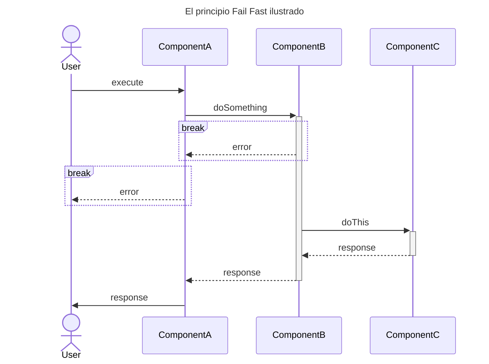
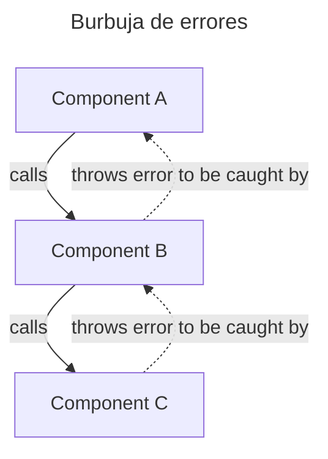
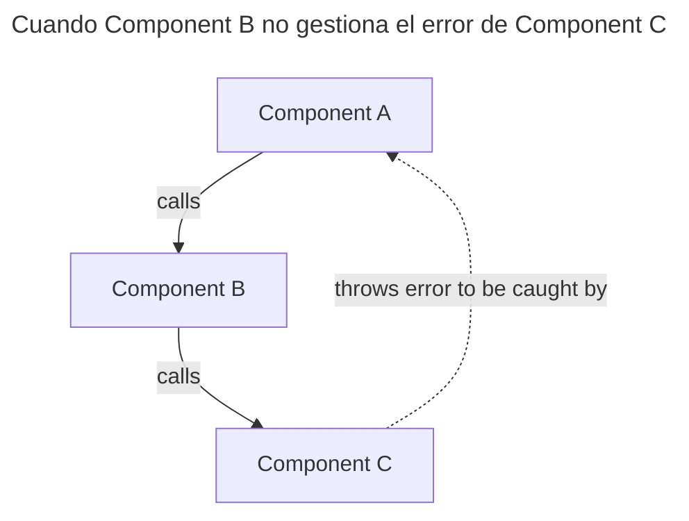

El patrón Result nos proporciona una forma explícita de gestionar los errores que se producen en el código.

## Gestión de errores

La gestión de errores es una de nuestras grandes preocupaciones a la hora de programar. 

Hay una gestión que podríamos considerar **preventiva**. Se produce cuando introducimos código que controla que ciertas condiciones nunca se lleguen a producir. Esto se puede hacer tomando un curso de acción alternativo o comunicando al usuario que cambie los datos de entrada para poder ejecutar lo que ha pedido.

La otra gestión es **reactiva**. Esta se produce cuando hemos capturado la condición de error y hacemos algo al respecto, como puede ser reintentar, terminar adecuadamente operaciones en curso (cerrar ficheros, liberar conexiones, etc.) e informar al usuario y proporcionarle opciones.

En general, en una aplicación no queremos que los errores lleguen como tales al usuario, sino que buscamos tener un mecanismo que nos permita, en el peor de los casos, informarle de lo que ha ocurrido y ofrecerle alternativas.

## Principio Fail Fast

El principio Fail Fast viene a decir que todo módulo que detecta un error debe comunicarlo a su módulo llamante cuanto antes. 

El módulo llamante puede tener el contexto adecuado para gestionar el problema o notificarlo a su propio llamante. Como hemos mencionado antes, esa gestión puede consistir en tomar un camino alternativo, reintentar o, como mínimo, asegurar que se terminan como es debido operaciones que puedan estar en curso y dejar el sistema en el estado más estable posible.

También se evita proseguir la ejecución del programa cuando no tiene sentido hacerlo. 

Aquí podemos una ilustración del principio. Cuando se produce un error en el `ComponentB` se comunica al `ComponentA` que, en este caso, lo comunica al usuario. De esta forma, nunca se llama a `ComponentC`.



## Excepciones y burbujas

En muchos lenguajes existe el concepto de _Exception_ o de _Error_. Este elemento permite provocar una interrupción del flujo del programa y ascender por la cadena de llamadas hasta el origen o hasta que se encuentre con un _catch_ que lo captura y hace algo con él. Si no es así, se detiene la ejecución del programa. Es un método que funciona, pero que no está exento de problemas. 




Estos errores tienen que capturarse y si no se hace nada llegarán hasta el usuario deteniendo el programa. Esta captura ha de hacerse de una forma explícita con una estructura `try/catch`. Esto nos lleva a que si un componente no hace ninguna gestión de los errores que puedan hacer otros componentes a los que llama, el que lo haya llamado inicialmente va a tener dificultades para saber que pueden llegarle errores.



Otro problema es que el mecanismo es muy drástico. En último término todo lo que consideremos como error puede, potencialmente, detener el programa abruptamente.

## Capturar y Lanzar

Para gestionar las excepciones o errores tenemos la estructura `try/catch`. En español, significa literalmente: intenta hacer esto (bloque `try`) y si se ha producido algún error que puedas reconocer (`catch`) haz esto otro. Algunos lenguajes admiten, además, el bloque `finally` para lo que se deba ejecutar tanto si ha habido error como si no.

En muchos lenguajes el bloque `catch` puede reconocer el tipo de error que ha capturado, lo que permite tener una respuesta personalizada para cada uno. En lenguajes que no, caso de Typescript (al menos de momento), tenemos que revisar el tipo de error para hacer esa personalización. En cualquier caso, suele ser recomendable tener siempre como respaldo la posibilidad de capturar cualquier tipo de error y tratarlo de manera genérica, especialmente si tenemos la sospecha de que podrían lanzarse excepciones que no están documentadas.

Esto nos sirve para manejar aquellos errores lanzados por el propio lenguaje en tiempo de ejecución o por librerías de terceras partes y que puedan producir errores no predecibles. Así, el módulo o unidad de código llamante puede usar la estructura `try/catch` para capturarlas y gestionarlas, ya sea para tomar alguna medida de recuperación, ya sea para comunicar que no puede continuar.

En este punto, nuestro código tiene que tomar decisiones. Si no se puede recuperar del error, quizá tenga que comunicarlo al módulo llamante. Esto se puede hacer usando el mismo mecanismo: lanzar una excepción o incluso relanzar la capturada. Lo más correcto, sin embargo, sería lanzar una nueva excepción acorde con el contexto.

Me explico. Supongamos que una librería de conexión a base de datos emite una excepción porque no es posible conectar con el servidor. El módulo que la llama, que podría ser un adaptador nuestro que hace una petición SQL para obtener unos datos, captura la excepción. Como el tipo de error es un problema de conexión que no es recuperable, lo suyo es informar al módulo que ha llamado a este adaptador. Ahora bien, la excepción original podría ser propia de esa tecnología concreta de bases de datos, detalle que no nos interesa.

Lo más adecuado sería que nuestro adaptador lanzase una nueva excepción que indique que no puede acceder a la base de datos y, por tanto, no puede obtener la información solicitada, que es el problema que nos preocupa. El mecanismo de excepciones suele permitir anidarlas, de modo que en la nueva excepción podemos incluir la original, lo que nos permite trazar el origen del problema.

Esto simplifica la gestión en los niveles llamantes. Nuestro adaptador de base de datos maneja las posibles excepciones que le pueda lanzar la librería y las traduce, por decirlo así, a un conjunto de excepciones que son significativas en el contexto en que es usado. Esto hace que el componente que lo use solo tenga que ocuparse de estas excepciones y, en todo caso, traducirlas para la siguiente capa.

Esta es una forma en la que nuestros componentes pueden lanzar excepciones propias: cuando capturan excepciones de otros componentes de los que dependen y las traducen para que las gestionen sus propios consumidores.

Aparte de eso, podemos lanzar excepciones para marcar los problemas encontrados por nuestro propio código. Si detectamos una condición que hace imposible proseguir una cierta acción podríamos indicarlo lanzando una excepción al módulo llamante.

## Alternativas a las excepciones

Otros lenguajes han adoptado una forma diferente de lidiar con errores. Empecemos por Go.

En Go una función puede retornar varios valores y, específicamente, se pide que toda función en la que se pueda producir un error, lo devuelva como último parámetro. Si no ha habido errores y todo ha ido bien, se devolverá `nil`.

El lenguaje nos fuerza a hacernos cargo de todo lo que devuelva la función, por lo que tenemos que tomar una decisión explícita acerca de cada uno de los valores devueltos, incluyendo el error. Podemos ignorarlo o podemos hacer algo con él, como anotarlo en un log o pasarlo en el retorno de la función actual.

Este es un ejemplo en el que se ignora explícitamente el error que pueda devolver `someFunction()`. Dejamos claro que no lo vamos a gestionar.

```go
result, _ := someFunction() 
```

Y aquí un ejemplo del tratamiento habitual de errores en Go. Si hay un error, hacemos algo con él, ya sea provocar un `panic` (error fatal que detiene el programa), ya sea guardar un log, seguir un curso de acción diferente, o lo que nos vaya bien.

```go
result, err := someFunction()

if (err != nil) {
	//
}
```

Aquí tiramos un `panic`, que interrumpe el flujo del programa. Los `panic` no se pueden capturar salvo con `recover` en una función diferida.

```go
result, err := someFunction()

if (err != nil) {
	panic(err)
}
```

## El patrón Result

En los lenguajes que no tienen soporte nativo para este tipo de gestión de errores, podemos usar el patrón `Result`. No he sido capaz de encontrar una versión _canónica_ del patrón, por lo que voy a dar mi interpretación personal en Typescript.

He aquí una serie de tests que definen el comportamiento de una clase Result<T>.

```typescript
describe('Result pattern', () => {
    it('should allow different types of result', () => {
        const stringResult = new SuccessResult('Hello world');
        expect(stringResult.unwrap()).toEqual('Hello world');

        const numericResult = new SuccessResult(1234.56);
        expect(numericResult.unwrap()).toEqual(1234.56)
    });

    it('should not allow error if it has result', () => {
        const result = new SuccessResult('Hello world');
        expect(() => {result.error()}).toThrow(Error)
    })

    it('should show success', () => {
        const result = new SuccessResult('Hello world');
        expect(result.successful()).toEqual(true)
    });

    it ('should not allow unwrap if it has error message', () => {
        const result = new FailedResult(new Error('Something wrong'));
        expect(() => {result.unwrap()}).toThrow(Error)
    })

    it ('should show fail', () => {
        const result = new FailedResult(new Error('Something wrong'));
        expect(result.failure()).toEqual(true)
    })

    it ('should provide error message if it contains any', () => {
        const result =  new FailedResult(new Error('Something wrong'));
        expect(result.error().message).toEqual('Something wrong');
    })
})
```

Este es el código que hace pasar los tests, implementando una interfaz `Result` que puede envolver cualquier tipo gracias al uso de genéricos. Empezaré por esta implementación que, siendo bastante simple, creo que es también fácil de entender.

```typescript
export interface Result<T> {
    successful(): boolean

    failure(): boolean

    unwrap(): T

    error(): Error
}

export class SuccessResult<T> implements Result<T> {
    private readonly result: T

    constructor(result: T) {
        this.result = result
    }

    failure(): boolean {
        return false
    }

    successful(): boolean {
        return true
    }

    error(): Error {
        throw new Error('This result has been successful')
    }

    unwrap(): T {
        return this.result
    }
}

export class FailedResult<T> implements Result<T> {
    private readonly fail: Error


    constructor(fail: Error) {
        this.fail = fail
    }

    failure(): boolean {
        return true
    }

    successful(): boolean {
        return false
    }

    unwrap(): T {
        throw new Error(`This result has an error. ${this.fail.message}`, {cause: this.fail})
    }

    error(): Error {
        return this.fail
    }
}
```

Básicamente, podemos crear dos tipos de Result: Exitoso o Fallido.

```typescript
const result = new SuccessResult('Hello world');
```

```typescript
new FailedResult(new Error('Something wrong'));
```

Ahora, podemos preguntarle a `Result` si es exitoso, en cuyo caso podremos desempaquetar la respuesta y usarla como sea conveniente:

```typescript
const result = someFunction(params)

if (result.successful()) {
    // Do something with the real result
    const response = result.unwrap()
}
```

Por supuesto, también podemos reaccionar al error:

```typescript
const result = someFunction(params)

if (result.failure()) {
    // Do something with the error
    const error = result.error()
}
```

El método `unwrap()` y el método `error()` están protegidos de modo que si intentamos desempaquetar un resultado cuando el resultado ha sido erróneo, se lanzará un error fatal. Y lo mismo, si intentamos extraer el mensaje de error cuando el resultado ha sido exitoso. Esto nos obliga a ser explícitas chequeando el error pues, de otro modo, no podemos hacer uso del resultado.

```typescript
// An error happened
const result = someFunction(params)

// The error is thrown if we try to get the response
const response = result.unwrap() 
```

```typescript
// An error happened
const result = someFunction(params)

// We make sure that we manage the possible error in the Result
if (result.failure()) {
    const error = result.error()
    // Do something with the error
}

// Now, we can safely use the response contained in the result
const response = result.unwrap()
```


La forma de aplicarlo en la vida real es muy simple. Al invocar una función o método que devuelve un objeto `Result`, lo primero que hacemos es comprobar si representa un éxito o un error. Esto es bastante similar a lo que vimos antes en Go.

```typescript
const result = someFunction(params)

if (result.failure()) {
    // Do something with the error
    const errorMesage = result.error().message
    console.log(errorMessage)
    exit(-1)
}

const response = result.unwrap()
```

En caso de error, hacemos lo que corresponda, que puede ser, entre otros:

* Hacer un log del error y retornar sin hacer nada.
* Relanzar el error de acuerdo al componente en el que estemos.
* Reintentar la operación.

Si el resultado es exitoso, desempaquetamos el _verdadero_ resultado de la función, que será del tipo que hayamos definido en su momento, y seguimos con lo que sea adecuado hacer.

Este diseño es simple y cubre bastante bien las necesidades básicas de una aplicación

## Aplicabilidad

El patron `Result` busca forzarnos a tener en cuenta los errores que puede devolver un módulo y gestionarlos de forma explícita.

Las excepciones se pueden _dejar pasar_ para que otro módulo de orden superior acabe capturándolas. Esto puede dar lugar a que excepciones de un nivel de infraestructura o de librerías puedan llegar muy _arriba_ en nuestra aplicación.

En cambio, el patrón `Result` no nos deja ignorar el hecho de que se haya producido un error. Por ejemplo, cuando queremos desempaquetar la respuesta, fallará si en realidad contiene un error.

Es posible combinar ambos patrones, excepciones y Result, en una aplicación.

El mayor inconveniente que le veo es el hecho de que añada un envoltorio en torno a la respuesta de una función o método. Pero, por otro lado, permite normalizar mucho lo que podemos esperar de un cierto componente: o bien una respuesta, o bien un error.

Mi impresión es que Result puede funcionar muy bien entre capas. O, como en el caso de la aplicación `Inventory` que he usado para ilustrar el desarrollo TDD Outside-in, para definir la interfaz de los puertos en Arquitectura Hexagonal.

En cualquier caso, es una herramienta más de la que disponer para diseñar nuestros sistemas.
