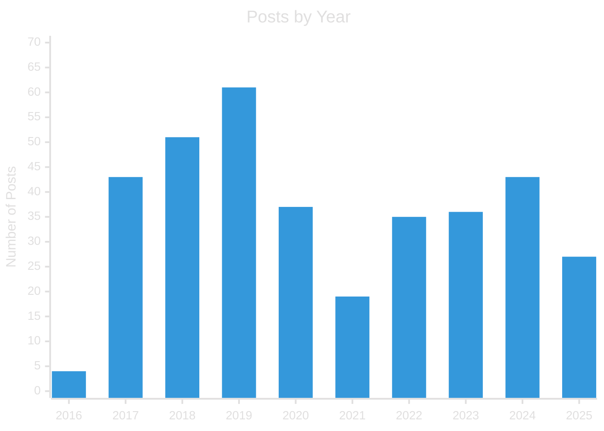
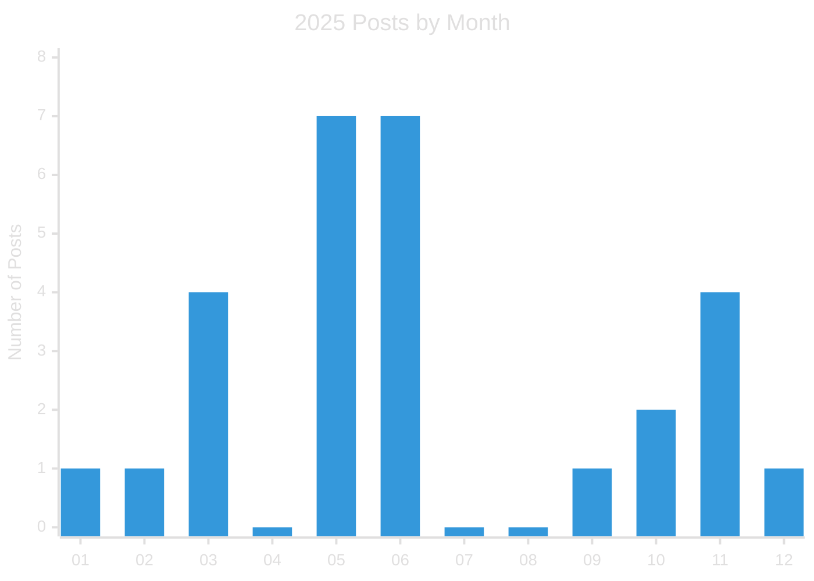

Después de casi una década de contenido, ¿Seguirá The Talking Bit en 2026?

## Nueve años de turra

Resulta que el blog acaba de cumplir nueve años de existencia. 2025 es el segundo año más flojo en cuanto a producción, tras 2021. No cuento 2016 porque solo hay cuatro posts de ese año al haber empezado en noviembre a publicar.

Esta es la cantidad de posts por año desde 2016:

|  Year  | Posts |
|:------:|------:|
|  2016  |     4 |
|  2017  |    43 |
|  2018  |    51 |
|  2019  |    61 |
|  2020  |    37 |
|  2021  |    19 |
|  2022  |    35 |
|  2023  |    36 |
|  2024  |    43 |
|  2025  |    29 |

La verdad es que hay algunas cifras bastante altas, porque en algunos casos estamos hablando de una media de más de tres artículos por mes, que se dice pronto.

2019 fue un año atípico porque me propuse el reto del "Blogtober", escribiendo un post al día durante un mes, lo que distorsiona un poco los datos. La cifra de actividad _real_ sería de unos 30 artículos.

2021, año post-pandemia, es el que menos artículos tiene. Creo recordar que fue el año del libro de "Aprender TDD", lo cual explicaría la menor dedicación al blog.

En esta gráfica se puede apreciar que hay una cierta regularidad de publicaciones, con una ligera tendencia a disminuir.

Y, en esta otra gráfica, tenemos la distribución de posts por meses durante este año.

Me ha sorprendido contar más de veinte post este año, pues tenía la impresión de que serían menos. Una cifra que no aparece aquí es que tengo varios en borrador que no he llegado a terminar, y alguno es casi seguro que no llevará a nada.

Algo característico de 2025 ha sido abordar algunos temas con artículos bastante largos, como por ejemplo la serie sobre arquitectura hexagonal y tdd.

También he dedicado un buen tiempo a un rediseño del blog, que falta le hacía, y refrescar un poco mis habilidades para el front-end, que tampoco son muchas.

Por cierto, que los gráficos de este artículo están hechos con [Mermaid](https://mermaid-js.github.io/mermaid/#/), algo que he empezado a introducir recientemente en los posts.

## Canal de vídeos parado

El último vídeo publicado en Youtube es de marzo de 2025. No tengo ninguno más en perspectiva y no espero que haya actividad en 2026.

Soy consciente de que el tipo de vídeos que hacía no es el mejor para destacar en Youtube, pero me consta que algunas personas los encuentran útiles para su aprendizaje. Obviamente, no es mi intención convertirme en _youtuber_.

Hacer un vídeo tiene su coste. Por una parte, es más fácil que escribir un artículo, pero por otra, necesitas practicarlo mucho para que salga como quieres y que no resulte muy confuso.

Además, la cantidad ingente de publicidad que introduce Youtube hace que me plantee si quiero seguir teniendo los vídeos publicados ahí.

De vez en cuando le doy vueltas a la posibilidad de contratar un hosting para quitar todo el contenido generado de las plataformas de terceros y así evitar anuncios y posibles bloqueos de acceso al mismo, etc.

Pero reconozco que me da pereza ponerme a ello.

## Sin libros este año

Gracias a la PulpoCon tenía un cierto incentivo para intentar sacar un libro, pero este año no lo hice y no tengo un tema en perspectiva que me resulte lo suficientemente interesante como para ponerme a escribir. Así que tampoco espero novedades por esa parte.

En un momento dado moví la publicación de alguno de los libros a Amazon, pero la considera un fracaso. Si bien la disponibilidad de los títulos impresos es bastante buena, la calidad de impresión me ha decepcionado mucho y las ventas tampoco han acompañado.

Al principio quise poner los libros en papel porque algunas personas me lo habían pedido, pero no acabo de encontrar el tiempo ni el ánimo para hacerlo con todos y hacerlo bien.

## Sin redes sociales

Hace ya un buen tiempo que dejé de participar en redes sociales, Twitter en particular, y la única de la que no me he borrado es LinkedIn, donde publico los posts del blog con un automatismo, ya que es mi principal via de comunicación con la mayor parte de mis contactos profesionales y me da acceso a las cada día más escasas ofertas de trabajo (apostaría a que mi edad me empieza a pasar factura).

No estar en estas conversaciones hace que sea más difícil saber si el contenido del blog genera algún tipo de interés y si se crea cierta comunidad alrededor. Lo cierto es que, de vez en cuando, aparecen algunos comentarios en el blog, pero no es muy frecuente.

Aunque escribo principalmente para mi, siempre es agradable saber que lo publicado llega a más personas y que tiene algo de difusión. 

No me planteo entrar a publicar a través de sistemas como Medium o Substack. Esto es por principios, ya que quiero que el contenido esté siempre abierto y no pretendo que sea monetizable. 

Github pages no impone ninguna restricción que afecte a esos principios, pero sigue siendo una plataforma de terceros y, como mencioné más arriba, me planteo ocasionalmente buscar un hosting. Sin embargo, tampoco veo que merezca mucho la pena si no va a haber continuidad en el futuro.

## Conclusiones: ¿Qué nos traerá el futuro?

Llevo un tiempo con una sensación de bastante cansancio y, francamente, no acabo de encontrar ni un tono ni temáticas que me impulsen a escribir como antes.

Por eso me ha sorprendido un poco haber superado los 25 artículos publicados en 2025, pues pensaba que serían bastante menos. Es verdad que tengo alguno en proceso que quizá salga pronto.

Es cierto que últimamente no me estoy encontrando temas en el trabajo que me lleven a darle vueltas en mi cabeza hasta plasmarlo en un post. Por otro lado, lo que me ronda últimamente tampoco me parece especialmente interesante como para publicar. Y a eso hay que añadir que la energía es menos y el tiempo disponible también.

Me he dado cuenta, y me preocupa un poco, que cada vez que intento explorar algún área de conocimiento (practicar front-end, desarrollo mobile, etc.) me siento como _obligado_ a intentar convertirlo en un post. Esto es algo bastante estúpido y lo que consigo es que no haga ni una cosa ni otra por puro agotamiento.

Así que preveo que 2026 va a ser un año flojo para The Talking Bit y no me sorprendería que el blog acabe aparcado por un tiempo. He de decir que no tengo ningún plan o decisión al respecto, simplemente que no quiero fijar expectativas en un sentido u otro. Esto debería ayudarme a quitar un poco de presión sobre el tema.

Es posible que aún pueda publicar algún artículo sobre Code Smells, pues tengo alguno a medio terminar, pero tras un impulso inicial bastante fuerte mi ánimo ha decaído bastante.

En resumidas cuentas, ya veremos qué pasa.

¡Feliz año nuevo!